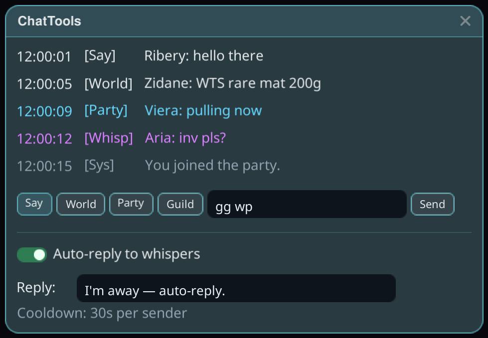

# ChatTools

チャットのキャプチャに加えて、どこにでも開いたままにできるウィンドウでチャットの快適機能も使えます。

## 使い方

1. プラグインをインストールし、ゲームを**Mod有効**で起動します。
2. Stellarオーバーレイから ChatTools ウィンドウを開きます。ゲームのチャットを色分けされたログとして記録します — 周辺、ワールド、パーティ、ウィスパー、システムメッセージがそれぞれ専用の色になります。
3. 下部の入力欄に入力し、チャンネルボタン(周辺 / ワールド / パーティ / ギルド)を選んで、ゲーム本体のチャット欄に触れずに送信できます。

## ウィスパーへの自動返信

**ウィスパーに自動返信**をオンにして返信文を設定すると、離席中(釣り、クラフト、放置)でも届いたウィスパーに自動で返信します。送信者ごとにクールダウンがあるため、誰にも連投されません。
