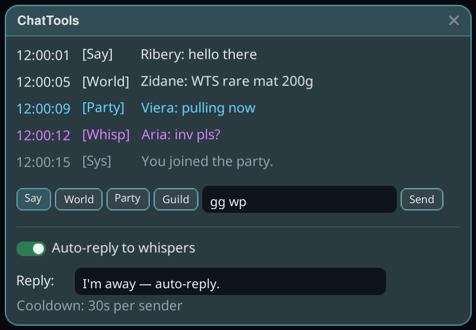

# ChatTools

Chat capture plus quality-of-life chat tools, in a window you can keep open anywhere.

## How to use

1. Install the plugin and launch the game **Modded**.
2. Open the ChatTools window from the Stellar overlay. It captures the game's chat into a
   colour-coded log — Say, World, Party, Whisper and system messages each get their own colour.
3. Type in the composer at the bottom and pick a channel button (Say / World / Party / Guild)
   to send without touching the game's own chat box.

## Auto-reply to whispers

Flip **Auto-reply to whispers** on and set your reply text — while you're away (fishing,
crafting, AFK), incoming whispers get your message back automatically, with a per-sender
cooldown so nobody gets spammed.
