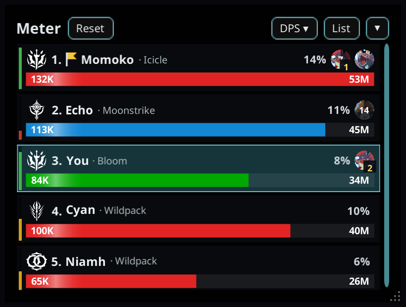
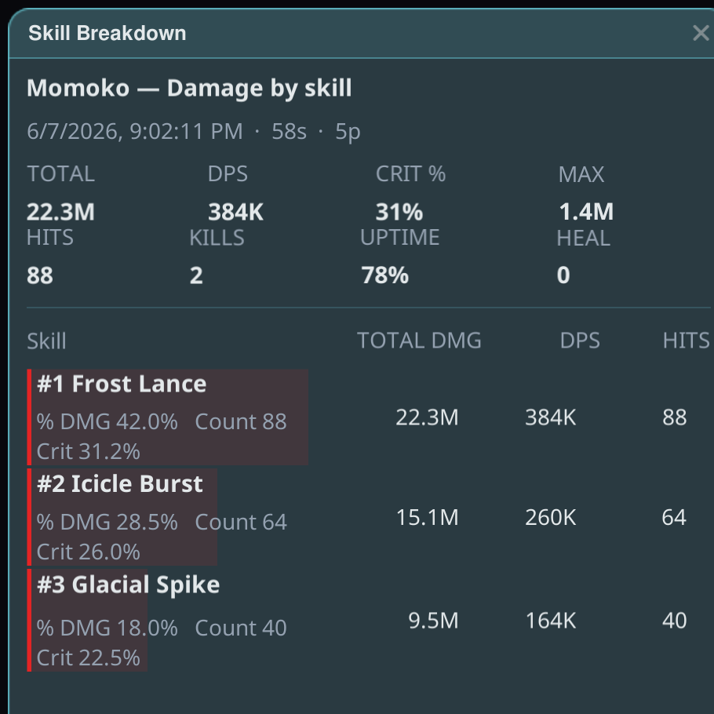
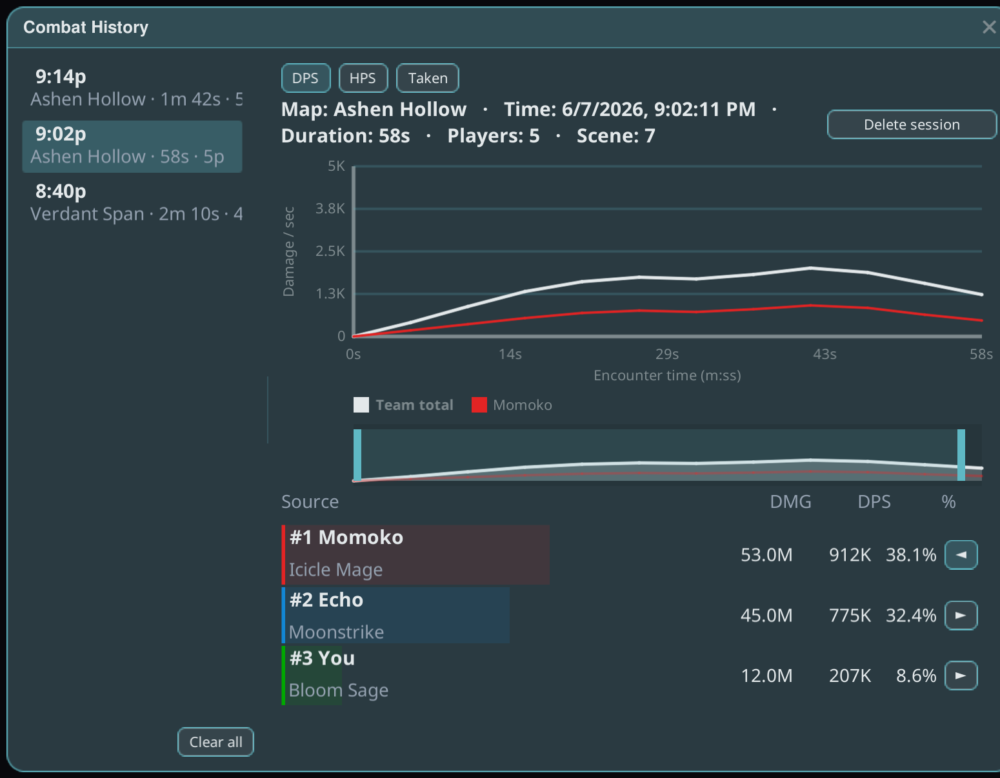

# CombatMeter

Star Resonance를 위한 실시간 파티 전투 미터입니다: 파티의 모든 사람에 대해 **DPS**, **HPS**,
**받은 피해** 를 역할 색상과 클래스 문장으로 표시해, 한눈에 파티 상황을 파악할 수 있습니다.

## 시작하기

1. 플러그인을 설치하고 게임을 **Modded**로 실행하세요.
2. 월드에 들어가면 미터가 오버레이 창으로 나타납니다. 제목 영역을 드래그하면 이동할 수 있으며 —
   위치가 기억됩니다.
3. 전투에 진입하면 파티원별로 행이 나타나고 실시간으로 갱신됩니다.

## 미터 읽는 법

- 각 행은 파티원 한 명입니다: 초당 피해량, 초당 치유량, 받은 피해.
- 행 색상은 파티원의 **역할**(탱커 / 힐러 / 딜러)을 따르며, 문장으로 클래스를 알 수 있습니다.
- 헤더에는 전투 타이머가 표시됩니다. 파티장에게는 파티 전체의 게임 풀 타이머를 시작하는
  **팀 카운트다운 버튼** 이 헤더에 표시됩니다.

## 스킬별 상세

파티원의 행을 클릭하면 **스킬별 상세** 가 열립니다 — 현재 전투의 스킬별 피해량 비중, 치명타율,
유지율을 볼 수 있습니다.

## 보관 — 전투 저장하기

*보관* 은 현재 전투를 기록에 저장하고 실시간 화면을 초기화합니다.

- **수동 보관**(보관 버튼)은 무슨 일이 있어도 **항상 저장** 됩니다 — 보관되었다는 것을 항상 눈에 보이는
  피드백으로 알 수 있습니다.
- **자동 보관** 은 전투를 자동으로 저장할 수 있습니다. **설정 패널(톱니바퀴 아이콘)** 을 열어 제어하세요:
  마스터 켜짐/꺼짐, 트리거별 전환(파티 전멸, 보스 페이즈, 비전투 대기, 던전 스테이지 변경), 보관 사이의
  최소 간격, 전투 종료 대기, 전멸 시 부활 유예 시간, 솔로일 때 무시.
- **보스 페이즈의 "선행 시간"** 을 사용하면 첫 보스 피격 전 몇 초의 준비 과정을 보스 구간에 포함시킬 수
  있습니다(기본값 꺼짐 = 첫 피격 시점에 정확히 자릅니다).
- 자동 보관은 말 그대로 아무 일도 일어나지 않았을 때(모든 행이 0)만 건너뜁니다. 건너뛴 보관은 아무것도
  지우지 않습니다 — 모든 것이 다음 보관으로 이어집니다.

## 업로드와 런 리플레이

보관된 런은 [Stellar Logs](https://logs.stellarresonance.app)에 업로드되며, 그곳에서 피해량 차트,
스킬 상세, 보스 페이즈, 그리고 던전에 들어간 순간부터 처치까지 전체 런의 **이동 리플레이** 를 포함한
전체 런 페이지를 볼 수 있습니다.

- **링크 복사** 는 런의 짧은 URL을 클립보드에 복사해 파티와 공유할 수 있게 합니다.
- **기록** 은 재접속 후에도 보관된 런을 유지합니다. 보관된 런을 다시 업로드하면 서버 측 데이터가
  유실되었더라도 요약, 전체 전투 상세, 이동 궤적을 포함한 원본 업로드를 그대로 재현합니다.

## 팁

- 직업 데이터가 아직 로드되지 않아도 미터는 작동합니다 — 로스터가 채워지기 전까지는 역할 색상과 문장을
  전문화로 추정합니다.
- 런 링크 업로드가 실패하면 기록에서 다시 시도하세요: 이미 업로드된 런은 실패하지 않고 기존 링크로
  연결됩니다.
