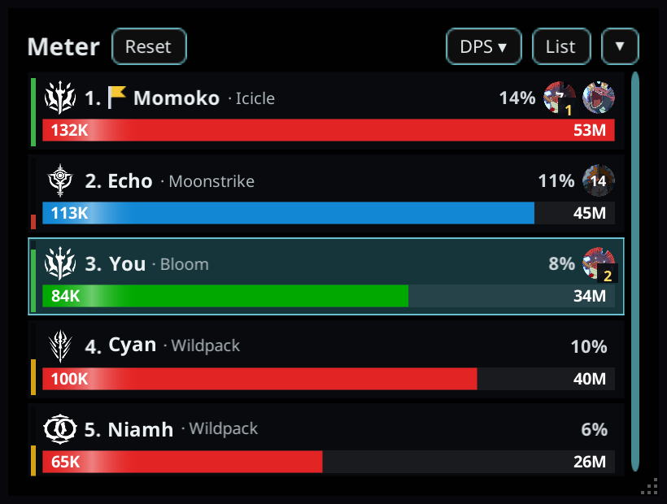
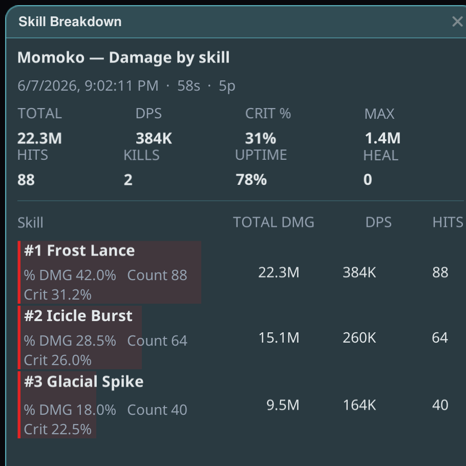
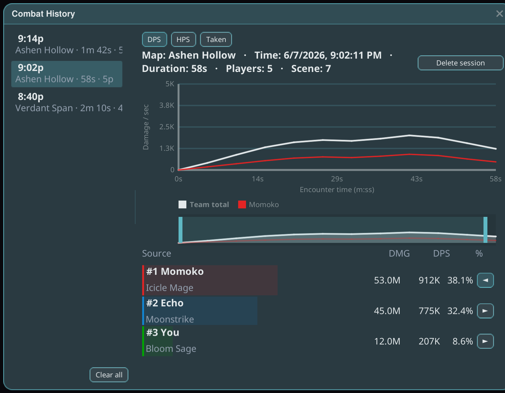

# CombatMeter

A real-time party combat meter for Star Resonance: live **DPS**, **HPS** and **damage taken**
for everyone in your party, with role colours and class crests so you can read the group at a
glance.

## Getting started

1. Install the plugin and launch the game **Modded**.
2. The meter appears as an overlay window once you're in the world. Drag its title area to move
   it — the position is remembered.
3. Enter combat: rows appear per party member and update live.

## Reading the meter

- Each row is one party member: damage per second, healing per second, and damage taken.
- Row colours follow the member's **role** (tank / healer / DPS); the crest shows their class.
- The header shows the encounter timer. Party leaders get a **team-countdown button** in the
  header to start the game's pull timer for the whole party.

## Skill breakdown

Click a party member's row to open their **skill breakdown** — per-skill damage share,
crit rate and uptime for the current fight.

## Archives — saving a fight

An *archive* banks the current fight into History and resets the live view.

- **Manual archive** (the archive button) is **always saved**, no matter what — you always get
  visible feedback that it was banked.
- **Auto-archive** can bank fights for you. Open the **Settings pane (gear icon)** to control
  it: master on/off, per-trigger toggles (team wipe, boss phase, combat idle, dungeon stage
  change), minimum gap between archives, settle wait, wipe revive-grace, and ignore-when-solo.
- **Boss phase "keep before"** lets a few seconds of run-up before your first boss hit ride
  into the boss segment (default off = cut exactly at the first hit).
- An auto archive is skipped only when literally nothing happened (every row all-zero). A
  skipped archive wipes nothing — everything carries into the next one.

## Uploads and run replay

Archived runs upload to [Stellar Logs](https://logs.stellarresonance.app), where you get the
full run page: damage charts, skill details, boss phases — and a **movement replay** of the
whole run, from the moment you walked into the dungeon to the kill.

- **Copy link** puts the run's short URL on your clipboard to share with your party.
- **History** keeps your archived runs across relaunches. Re-uploading an archived run
  reproduces the exact original upload — summary, full combat detail, and the movement track —
  even if the server-side data was lost.

## Tips

- The meter works even if profession data hasn't loaded yet — role colour and crest are
  inferred from your spec until the roster fills in.
- If a run link fails to upload, retry from History: an already-uploaded run resolves to its
  existing link instead of failing.
