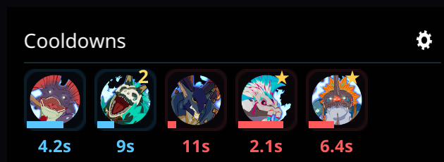
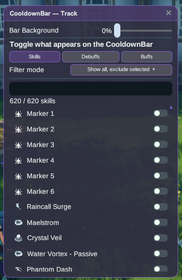

# CooldownBar

Cooldown skill-mu di linimasa yang bisa dipindah, jadi kamu bisa lihat apa yang akan siap lagi
tanpa harus menatap hotbar.

## Cara pakai

1. Pasang plugin-nya lalu jalankan game dalam mode **Dengan mod**.
2. Bilah akan muncul sebagai overlay. Seret ke mana pun kamu mau — posisinya akan diingat.
3. Ikon skill akan bergeser di sepanjang linimasa seiring cooldown-nya berkurang; saat ikon
   mencapai ujung, skill itu siap dipakai.

## Tips

- Buff yang me-refresh timer-nya saat dapat stack baru akan tetap terlihat dengan hitung
  mundur yang akurat untuk seluruh durasi yang di-refresh.
