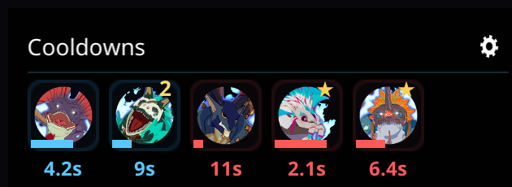
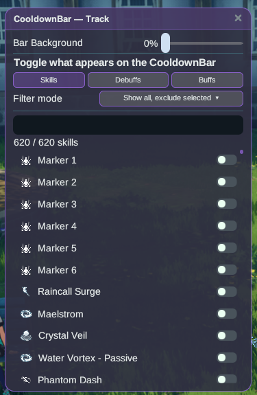

# CooldownBar

Your skill cooldowns on a movable timeline, so you can see what's coming back without
staring at the hotbar.

## How to use

1. Install the plugin and launch the game **Modded**.
2. The bar appears as an overlay. Drag it wherever you want — the position is remembered.
3. Skill icons slide along the timeline as their cooldowns tick down; when an icon reaches
   the end, the skill is ready.

## Tips

- Buffs that refresh their timer on a new stack stay visible with an accurate countdown for
  the full refreshed duration.
