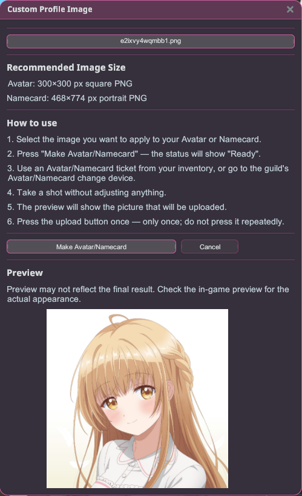

# Gambar Profil Kustom

Gunakan PNG apa pun sebagai avatar atau kartu nama dalam game-mu — tanpa perlu foto dari kamera
dalam game. Berfungsi bahkan jika akun Windows-mu, gambarmu, atau game itu sendiri terpasang di
folder dengan karakter non-Inggris.

## Cara menggunakan

1. Instal plugin lalu jalankan game dalam mode **Dengan mod**, kemudian masuk ke dunia.
2. Buka jendela **Gambar Profil Kustom** dari overlay Stellar.
3. **Pilih gambar** yang ingin kamu terapkan ke Avatar atau Kartu Nama-mu. Jendela pemilih file PNG
   bawaan akan terbuka — jika tidak terlihat, mungkin tersembunyi di belakang jendela game: tekan
   **Alt+Tab** untuk membawanya ke depan, atau jalankan game dalam mode **Borderless / Windowed**.
4. Tekan **Buat Avatar/Kartu Nama** — status akan menampilkan **Siap**.
5. Di dalam game, gunakan **tiket Avatar / Kartu Nama** dari inventarismu, atau pergi ke
   **perangkat pengubah Avatar / Kartu Nama milik guild**.
6. **Ambil bidikan tanpa mengatur apa pun.** Pratinjau akan menampilkan gambar yang akan diunggah.
7. Tekan **tombol unggah game sekali saja** — hanya sekali; jangan menekannya berulang kali.

Satu gambar yang dipilih melayani keduanya: plugin secara otomatis menerapkannya sebagai
**Avatar** atau **Kartu Nama**-mu, tergantung mana yang sedang kamu ubah di dalam game.

## Ukuran gambar yang direkomendasikan

- **Avatar:** PNG persegi 300×300 px
- **Kartu Nama:** PNG potret 468×774 px

Dengan mendekati ukuran ini, kamu menghindari game yang mengubah skala atau memotong gambarmu.
Pratinjau di dalam jendela mungkin tidak sepenuhnya cocok dengan hasil akhir — periksa pratinjau
dalam game sebelum kamu mengonfirmasi.
