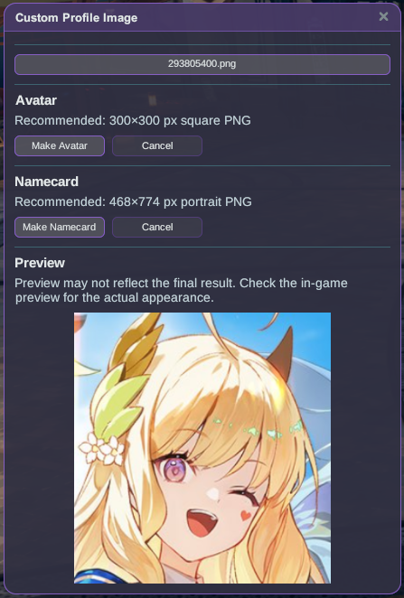

# Custom Profile Image

Use any PNG as your in-game avatar or namecard — no in-game camera required.

## How to use

1. Install the plugin and launch the game **Modded**.
2. Open the **Custom Profile Image** window from the Stellar overlay.
3. Pick your PNG with the file button at the top (native file picker, filtered to PNG).
4. Click what you want it to become:
   - **Make Avatar** — recommended 300×300 px square PNG.
   - **Make Namecard** — recommended 468×774 px portrait PNG.
5. Check the **Preview** — it may not reflect the final result exactly, so confirm the
   in-game appearance afterwards.

## Tips

- Stick close to the recommended sizes — the game scales other ratios, which can blur or
  crop your picture.
