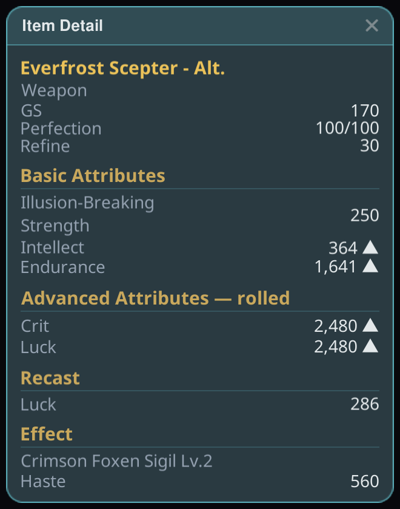
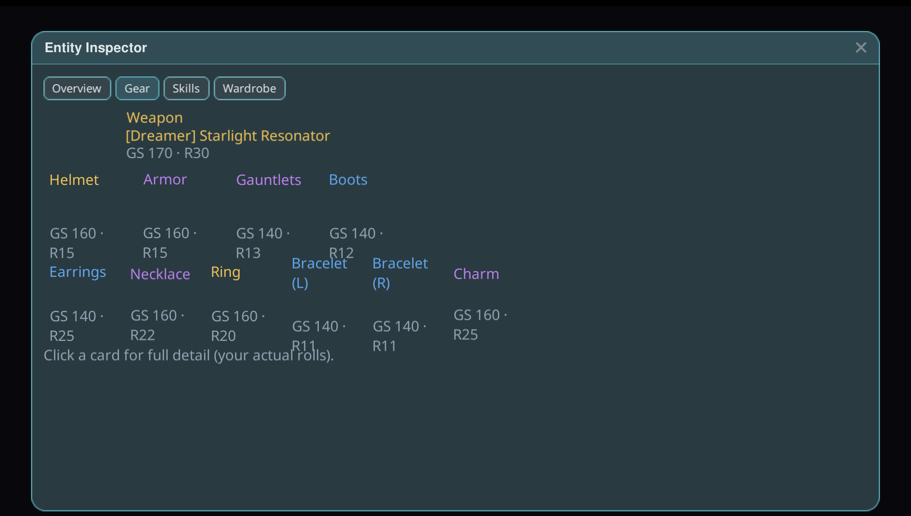

# ตัวตรวจสอบเอนทิตี

ตรวจสอบเอนทิตีใดก็ได้ในโลกเกม: ข้อมูลประจำตัว แอตทริบิวต์ อุปกรณ์ที่สวมใส่ และสกิลบุ๊ก — ในหน้าต่าง
เดียวที่เปิดดูใครก็ได้

## วิธีใช้งาน

1. ติดตั้งปลั๊กอินแล้วเปิดเกมแบบ **Modded**
2. เปิดการตรวจสอบได้จากจุดเริ่มต้นสองทาง:
   - **ปุ่มแว่นขยาย** บนการ์ดโปรไฟล์ หรือ
   - รายการ **Inspect** บนแถวของ CombatMeter (เมื่อติดตั้ง CombatMeter ไว้)
3. หน้าต่างจะแสดงข้อมูลประจำตัว แอตทริบิวต์ อุปกรณ์พร้อมรายละเอียด และสกิลบุ๊กของเอนทิตีนั้น
   ลากภาพพอร์ตเทรต 3D เพื่อหมุนดู — การหมุนแนวตั้งไม่ถูกจำกัด จึงมองได้จากทุกมุม

## เคล็ดลับ

- หน้าต่างตัวตรวจสอบจะเปิดอยู่เหนือหน้าต่างอื่นเสมอ จึงไม่มีทางถูกบังอยู่หลังมิเตอร์ระหว่างการต่อสู้
