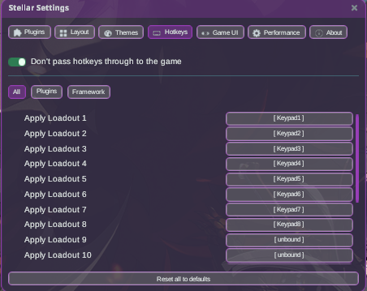

# LoadoutSwitcher

Lumipat sa pagitan ng mga naka-save mong in-game na loadout (Role Plans) gamit ang hotkey.

## Paano gamitin

1. I-install ang plugin at buksan ang laro sa mode na **Modded**.
2. I-save ang mga loadout mo sa laro gaya ng dati (Role Plans).
3. Buksan ang **Stellar Settings → Hotkeys**, i-expand ang grupong **loadout**, at mag-bind ng mga
   key para sa **apply.1** hanggang **apply.8** (hindi pa naka-bind bilang default). Ina-apply ng
   hotkey na *n* ang *n*-na loadout sa naka-save mong listahan.

4. Pindutin ang hotkey habang nasa mundo — nililipat ng plugin sa pamamagitan ng sariling loadout
   flow ng laro.

## Pagkopya ng isang loadout

Buksan ang window ng Loadout Switcher. Ang bawat loadout maliban sa suot mo ngayon ay may button
na nagpapakita ng pangalan ng kasalukuyan mong loadout, tulad ng "← Ici-LF". I-click ito sa row na
gusto mong i-overwrite, tingnan ang tanong ("I-overwrite gamit ang Ici-LF?"), at pindutin ang ✓.

- Kinokopya nito ang suot mo ngayon: gear, modules, skills, talents, Battle Imagines, at ang
  Deep-Slumber binding. Mananatiling pareho ang pangalan ng loadout.
- Kung may mga unsaved na pagbabago ka, o babaguhin ng kopya ang class ng loadout na iyon, ipapakita
  muna ng confirm ang isang babala.
- Kinukumpirma ito ng laro gamit ang sarili nitong mensahe na "Loadout saved successfully!". Kapag
  tumanggi ang laro (halimbawa habang nasa labanan), walang mababago.

## Mga Tip

- I-on ang **Huwag ipasa ang mga hotkey sa laro** sa itaas ng Hotkeys panel para hindi rin
  ma-trigger ng mga naka-bind mong key ang mga aksyon ng laro habang lumilipat ka.

## Feedback

Gumagamit ang resulta ng paglipat ng native na notice banner ng laro: isang success banner kapag
na-apply ang plan, at isang guard notice kapag hindi pwedeng lumipat sa ngayon (halimbawa habang
may isa pang paglipat na gumagana pa, o hindi pa handa ang loadout API).
