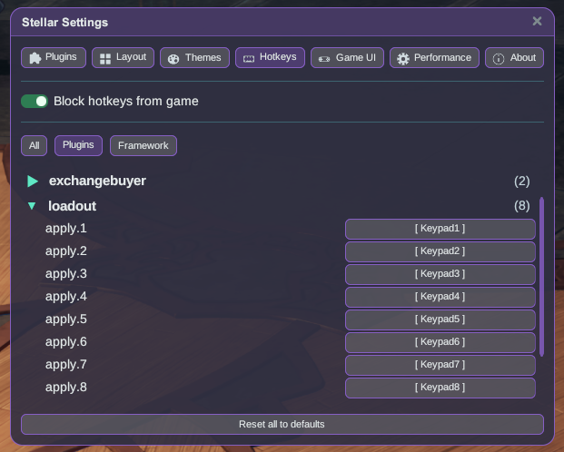

# LoadoutSwitcher

Switch between your saved in-game loadouts (Role Plans) with a hotkey.

## How to use

1. Install the plugin and launch the game **Modded**.
2. Save your loadouts in the game as usual (Role Plans).
3. Open **Stellar Settings → Hotkeys**, expand the **loadout** group and bind keys to
   **apply.1** through **apply.8** (they ship unbound). Hotkey *n* applies the *n*-th
   loadout in your saved list.

4. Press the hotkey in the world — the plugin switches through the game's own loadout flow.

## Tips

- Turn on **Block hotkeys from game** at the top of the Hotkeys panel so your bound keys
  don't also trigger game actions while you switch.

## Feedback

Switch results use the game's native notice banners: a success banner when the plan is
applied, and a guard notice when switching isn't possible right now (for example while
another switch is still in flight, or when the loadout API isn't ready yet).
