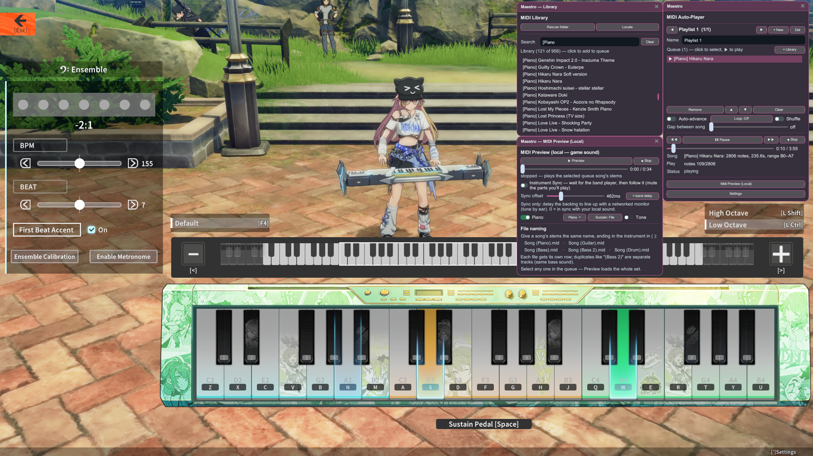
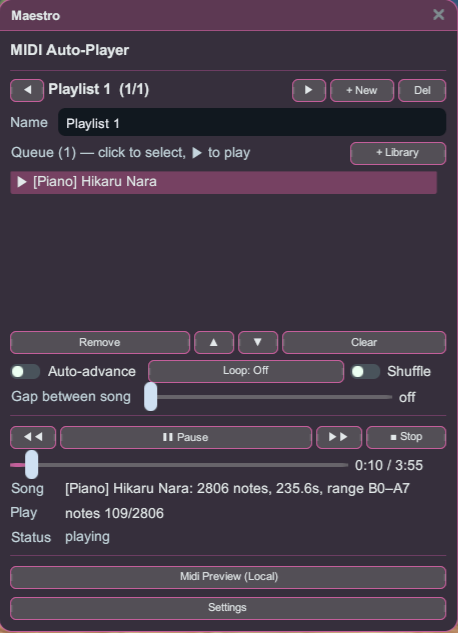
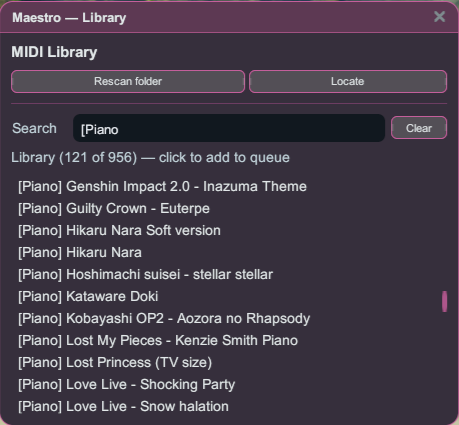
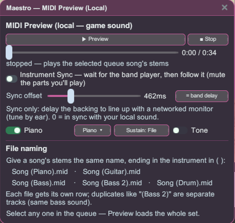
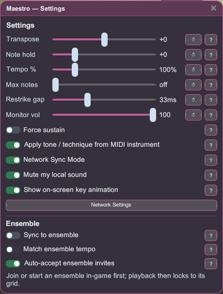

# Maestro

A MIDI auto-player for Star Resonance's Season-3 band (Musician) instrument. Drop your `.mid`
files in a folder, pick a song, and Maestro performs it for you on your summoned instrument —
solo or in a group — with playlists, group sync, and a local sound preview.



## Getting started

1. Install the plugin and launch the game **Modded**.
2. Open **Maestro** from the Stellar launcher (Plugins group). Band tools are in-world only.
3. Put your `.mid` / `.midi` files in the game's `midi\` folder — Maestro creates it and shows the
   path in the **Library** window. Use **Rescan folder** or **Locate** if you move it.
4. Summon a free-play instrument in-game, add songs from the **Library** to the queue, and hit ▶.

## Playing songs

The main window is your player: a playlist, the now-playing queue, and transport controls.



- Build named **playlists** and reorder the queue; the header shows the current song and position.
- **Auto-advance**, **Loop** (off / all / one), **Shuffle**, and a **gap between songs** are all
  one click away.
- The status line shows the live position and note count for the song that's playing.

## Finding songs



- Browse your whole MIDI folder, **search** by name, and click a song to add it to the queue.
- Playback performs a single instrument at a time, so just queue the stem you want to play.

## Preview before you play

Audition a song through the **real in-game instrument sounds** without summoning an instrument — the
preview plays just for you, so no one around you hears it.



- One row per stem, with per-part **mute** and a **sustain** mode, so you can hear exactly how a
  song will come out.
- **Instrument Sync** waits for the live band player and follows along, muting the parts you'll
  play yourself — handy for jamming with someone else.

Preview is where the multi-stem naming matters: give a song's parts the same base name, ending in
the instrument in parentheses, and Preview loads the **whole set** when you select any one of them.

```
Song (Piano).mid   Song (Guitar).mid   Song (Bass).mid   Song (Bass 2).mid   Song (Drum).mid
```

Duplicates like `(Bass 2)` become their own track on the same instrument sound.

## Per-song controls & group play

Open **Settings** for the fine-tuning and group options.



- **Per-song**: Transpose, Note hold, Tempo %, Max notes (polyphony cap), Restrike gap, Monitor
  volume, Force sustain, and Apply tone/technique from the MIDI.
- **Network Sync** streams your notes ahead of time so listeners around you hear a steadier
  performance under dense note streams.
- **Ensemble**: lock playback to your group's shared beat (count-in to the downbeat), optionally
  match the ensemble tempo, and auto-accept invites so everyone starts together. Join or start an
  ensemble in-game first.

## Preparing your MIDI files

Maestro plays your MIDI as written, so a little prep makes songs sound right on the game
instruments.

### Effects (tone & technique)

Turn on **Apply tone / technique from MIDI instrument** in Settings, and Maestro picks the
guitar/bass effect from the **instrument (program) assigned to the stem's track**. Set that track's
General MIDI instrument in your DAW:

**Guitar stems**

| Assign this GM instrument | Program # | Plays as |
|---|:--:|---|
| Nylon / Steel / Jazz / Clean Electric Guitar | 25–28 | Clean |
| Muted Guitar | 29 | Muffled (palm-mute) |
| Overdriven Guitar | 30 | Overdrive |
| Distortion Guitar | 31 | Distortion |
| Guitar Harmonics | 32 | Harmonics |

**Bass stems**

| Assign this GM instrument | Program # | Plays as |
|---|:--:|---|
| Acoustic / Finger / Pick / Fretless Bass | 33–36 | Clean |
| Slap Bass 1 / 2 | 37 / 38 | Slap |
| Synth Bass 1 / 2 | 39 / 40 | Overdrive |

- Program numbers are the **1–128** values your DAW shows; match by **instrument name** if unsure.
- Only the stem's **main instrument** is read, so keep one instrument per stem. A program change
  partway through the track switches the effect from that point on.
- Effects apply to **guitar and bass only** — piano and drums ignore them.
- The effect is matched to the instrument you actually summon. **Bass has no distortion** — it
  plays as Overdrive — and any technique the summoned instrument can't do falls back to normal.
- **Overdrive / Distortion is local-only in Network Sync** (see *Known limitation* below). Muffled,
  Harmonics and Slap are heard by everyone.

### Drums

The game drum kit is a fixed **9-piece kit** on the keys below, and Maestro plays your notes exactly
as written — it does **not** auto-convert General MIDI drums — so a drum stem must use these keys:

| MIDI note | Piece |
|:--:|---|
| 62 (D4) | Closed Hi-Hat |
| 65 (F4) | Kick |
| 69 (A4) | Floor Tom |
| 72 (C5) | Snare |
| 74 (D5) | Mid Tom |
| 76 (E5) | High Tom |
| 77 (F5) | Ride |
| 79 (G5) | Open Hi-Hat |
| 81 (A5) | Crash |

Any note off these keys is silent. Starting from a standard General MIDI drum track? Remap the
usual GM notes onto these keys — kick (GM 35/36) → **F4**, snare (38/40) → **C5**, closed hat (42)
→ **D4**, open hat (46) → **G5**, ride (51) → **F5**, crash (49) → **A5**, toms → **A4 / D5 / E5**.

### A few more tips

- **One note per pitch:** each instrument sounds one voice per pitch, so two identical overlapping
  notes count as one — avoid stacked unisons.
- **Mind the range:** notes outside an instrument's playable range are silent. Use **Transpose**
  (Settings) to bring a part into range.
- **Volume isn't reproduced:** every note plays at a fixed loudness, so velocity and dynamics won't
  carry over.
- MIDI **type 0 or 1** files are supported.

## Known limitation

**Overdrive / Distortion doesn't reach other players — this is a game bug, not something Maestro can
fix.** The game only ever renders the guitar/bass overdrive/distortion *tone* on your own client and
never sends it to the people around you. So it plays Clean for everyone else whenever **Network Sync
is on**, and even with Network Sync **off**, only *you* hear the distortion — other players never
hear your overdrive/distortion in either mode. No Maestro setting changes this; it's up to the game
to fix. *Techniques* (Muffled, Harmonics, Slap) are unaffected and are heard by everyone. For
distortion-critical songs, play with Network Sync **off** so at least it sounds right to you.
