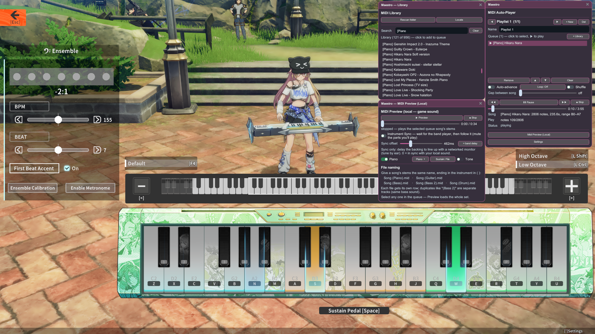
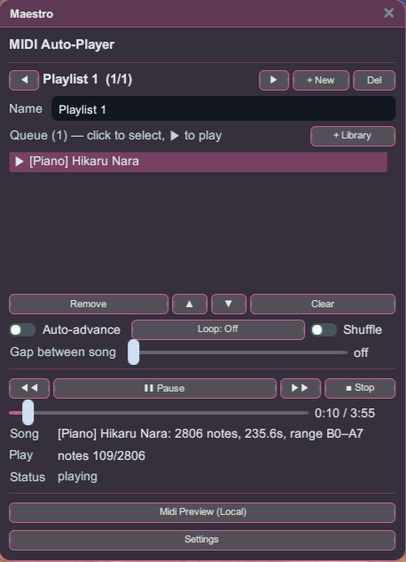
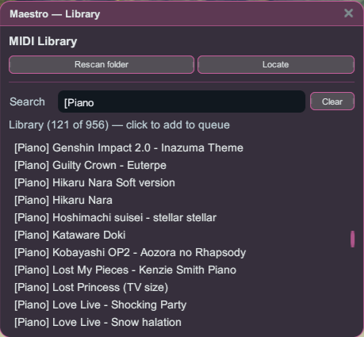
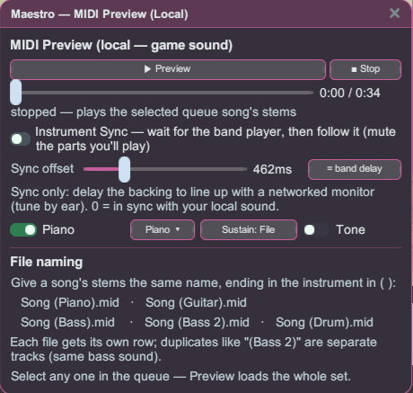
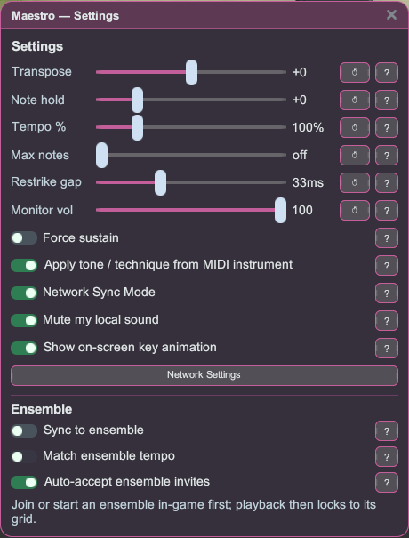

# Maestro

ปลั๊กอินเล่น MIDI อัตโนมัติสำหรับเครื่องดนตรีวงดนตรี (นักดนตรี) ซีซัน 3 ของ Star Resonance วางไฟล์ `.mid` ของคุณไว้ในโฟลเดอร์ เลือกเพลง แล้ว Maestro จะเล่นให้คุณผ่านเครื่องดนตรีที่เรียกออกมา — เล่นคนเดียวหรือเป็นกลุ่มก็ได้ — พร้อมเพลย์ลิสต์ การซิงก์กลุ่ม และพรีวิวเสียงในเครื่อง



## เริ่มต้นใช้งาน

1. ติดตั้งปลั๊กอินแล้วเปิดเกมแบบ **ใช้ม็อด**
2. เปิด **Maestro** จาก Stellar launcher (กลุ่ม Plugins) เครื่องมือวงดนตรีใช้ได้เฉพาะในโลกเกมเท่านั้น
3. วางไฟล์ `.mid` / `.midi` ของคุณไว้ในโฟลเดอร์ `midi\` ของเกม — Maestro จะสร้างโฟลเดอร์นี้ให้และแสดงพาธไว้ในหน้าต่าง **คลัง** ใช้ **สแกนโฟลเดอร์ใหม่** หรือ **เปิดตำแหน่ง** หากคุณย้ายโฟลเดอร์
4. เรียกเครื่องดนตรีโหมดเล่นอิสระในเกม เพิ่มเพลงจาก **คลัง** เข้าคิว แล้วกด ▶

## เล่นเพลง

หน้าต่างหลักคือตัวเล่นของคุณ: เพลย์ลิสต์ คิวเพลงที่กำลังเล่น และตัวควบคุมการเล่น



- สร้าง **เพลย์ลิสต์** ที่ตั้งชื่อได้และจัดเรียงคิวใหม่ได้ หัวข้อจะแสดงเพลงปัจจุบันและตำแหน่งการเล่น
- **เล่นต่ออัตโนมัติ** **วนซ้ำ** (ปิด / ทั้งหมด / เพลงเดียว) **สุ่ม** และ **ช่วงพักระหว่างเพลง** คลิกเดียวก็ปรับได้
- บรรทัดสถานะแสดงตำแหน่งการเล่นและจำนวนโน้ตแบบเรียลไทม์ของเพลงที่กำลังเล่นอยู่

## ค้นหาเพลง



- เรียกดูโฟลเดอร์ MIDI ทั้งหมด **ค้นหา** ด้วยชื่อ แล้วคลิกเพลงเพื่อเพิ่มเข้าคิว
- การเล่นจะเล่นทีละเครื่องดนตรีเดียว ดังนั้นเพิ่มเฉพาะสเต็มที่ต้องการเล่นเข้าคิวก็พอ

## พรีวิวก่อนเล่น

ทดลองฟังเพลงผ่าน **เสียงเครื่องดนตรีในเกมจริง** โดยไม่ต้องเรียกเครื่องดนตรีออกมา — พรีวิวจะเล่นให้คุณฟังคนเดียวเท่านั้น คนรอบข้างจะไม่ได้ยิน



- หนึ่งแถวต่อหนึ่งสเต็ม พร้อม **ปิดเสียง** แยกแต่ละส่วนและโหมด **ซัสเทน** ทำให้คุณได้ยินว่าเพลงจะออกมาเป็นอย่างไรจริง ๆ
- **ซิงก์เครื่องดนตรี** จะรอตัวเล่นวงที่กำลังเล่นสดแล้วตามไป โดยปิดเสียงพาร์ตที่คุณจะเล่นเอง — มีประโยชน์เวลาแจมกับคนอื่น

พรีวิวเป็นจุดที่การตั้งชื่อหลายสเต็มมีความสำคัญ: ตั้งชื่อฐานของแต่ละพาร์ตในเพลงให้เหมือนกัน แล้วลงท้ายด้วยชื่อเครื่องดนตรีในวงเล็บ พรีวิวจะโหลด **ทั้งชุด** เมื่อคุณเลือกพาร์ตใดพาร์ตหนึ่ง

```
Song (Piano).mid   Song (Guitar).mid   Song (Bass).mid   Song (Bass 2).mid   Song (Drum).mid
```

ชื่อซ้ำอย่าง `(Bass 2)` จะกลายเป็นแทร็กแยกของเสียงเครื่องดนตรีเดียวกัน

## การตั้งค่าต่อเพลง & การเล่นเป็นกลุ่ม

เปิด **ตั้งค่า** เพื่อปรับแต่งละเอียดและตัวเลือกสำหรับกลุ่ม



- **ต่อเพลง**: เปลี่ยนระดับเสียง, ค้างโน้ต, จังหวะ%, โน้ตสูงสุด (ขีดจำกัดโพลีโฟนี), ช่วงตีซ้ำ, ระดับมอนิเตอร์, บังคับซัสเทน และใช้โทน/เทคนิคจาก MIDI
- **โหมดซิงก์เครือข่าย** สตรีมโน้ตของคุณล่วงหน้า ทำให้ผู้ฟังรอบข้างได้ยินการแสดงที่นิ่งขึ้นแม้ในช่วงโน้ตหนาแน่น
- **วงดนตรี**: ล็อกการเล่นให้ตรงจังหวะร่วมของกลุ่ม (นับนำเข้าดาวน์บีต) ปรับให้ตรงจังหวะวงได้ตามต้องการ และรับคำเชิญอัตโนมัติเพื่อให้ทุกคนเริ่มพร้อมกัน ต้องเข้าร่วมหรือเริ่มวงดนตรีในเกมก่อน

## เล่นในวงดนตรี

โหมดวงดนตรีล็อกการแสดงของทั้งปาร์ตี้ให้ตรงจังหวะเดียวกัน ทำให้ผู้เล่นหลายคนเล่นพาร์ตต่างกันของเพลงเดียวกันพร้อมกันแบบซิงก์ได้ ทุกคนต้อง **อยู่ปาร์ตี้เดียวกัน**

1. **เปิดซิงก์วงดนตรี** ใน **ตั้งค่า** เปิดใช้ **ซิงก์กับวงดนตรี** — ในผู้เล่นทุกคน การเปิด **รับคำเชิญวงดนตรีอัตโนมัติ** ด้วยก็เป็นทางเลือก เพื่อไม่ต้องรับคำเชิญเองทีละคน
2. **ผู้เล่นแต่ละคนเลือกพาร์ตแล้วกด ▶** เลือกสเต็มที่จะเล่นแล้วกดเล่น — Maestro จะไม่เริ่มทันทีแต่จะค้างไว้และแสดง **"กำลังรอวงดนตรี…"**
3. **หัวหน้าปาร์ตี้เริ่มวงดนตรีในเกม** นี่คือการเริ่มวงดนตรีของเกมเอง
4. **ทุกคนเล่นพร้อมกันแบบซิงก์** ผู้เล่นที่รออยู่ทั้งหมดจะเริ่มพร้อมกันที่ดาวน์บีต ล็อกกับจังหวะของวงดนตรี

สำหรับวงเต็มรูปแบบ ให้ผู้เล่นแต่ละคนเพิ่มพาร์ต **ที่ต่างกัน** (กีตาร์ เบส กลอง เปียโน) ของเพลงเดียวกันเข้าคิวและเปิด **จับจังหวะให้ตรงวงดนตรี** ตามต้องการ เพื่อให้การเล่นตามค่า BPM ของวง ใช้ **พรีวิว** ล่วงหน้าเพื่อฟังว่าทั้งชุดเข้ากันอย่างไร

## เตรียมไฟล์ MIDI ของคุณ

Maestro เล่นตาม MIDI ที่เขียนไว้ตรง ๆ ดังนั้นการเตรียมเพลงเล็กน้อยจะช่วยให้เสียงออกมาถูกต้องบนเครื่องดนตรีในเกม

### เอฟเฟกต์ (โทนและเทคนิค)

เปิด **ใช้โทน/เทคนิคจากเครื่องดนตรี MIDI** ในตั้งค่า แล้ว Maestro จะเลือกเอฟเฟกต์กีตาร์/เบสจาก **เครื่องดนตรี (โปรแกรม) ที่กำหนดให้แทร็กของสเต็มนั้น** ตั้งค่าเครื่องดนตรี General MIDI ของแทร็กนั้นใน DAW ของคุณ:

**สเต็มกีตาร์**

| กำหนดเครื่องดนตรี GM นี้ | หมายเลขโปรแกรม | เล่นเป็น |
|---|:--:|---|
| Nylon / Steel / Jazz / Clean Electric Guitar | 25–28 | Clean |
| Muted Guitar | 29 | Muffled (palm-mute) |
| Overdriven Guitar | 30 | Overdrive |
| Distortion Guitar | 31 | Distortion |
| Guitar Harmonics | 32 | Harmonics |

**สเต็มเบส**

| กำหนดเครื่องดนตรี GM นี้ | หมายเลขโปรแกรม | เล่นเป็น |
|---|:--:|---|
| Acoustic / Finger / Pick / Fretless Bass | 33–36 | Clean |
| Slap Bass 1 / 2 | 37 / 38 | Slap |
| Synth Bass 1 / 2 | 39 / 40 | Overdrive |

- หมายเลขโปรแกรมคือค่า **1–128** ที่ DAW ของคุณแสดง หากไม่แน่ใจให้จับคู่ด้วย **ชื่อเครื่องดนตรี**
- จะอ่านเฉพาะ **เครื่องดนตรีหลัก** ของสเต็มเท่านั้น จึงควรให้แต่ละสเต็มมีเครื่องดนตรีเดียว การเปลี่ยนโปรแกรมกลางแทร็กจะเปลี่ยนเอฟเฟกต์ตั้งแต่จุดนั้นเป็นต้นไป
- เอฟเฟกต์ใช้ได้กับ **กีตาร์และเบสเท่านั้น** — เปียโนและกลองจะไม่มีผล
- เอฟเฟกต์จะถูกจำกัดตามเครื่องดนตรีที่คุณเรียกออกมาจริง **เบสไม่มีดิสทอร์ชัน** — จะเล่นเป็น Overdrive แทนและเทคนิคใดที่เครื่องดนตรีที่เรียกออกมาทำไม่ได้จะกลับไปเล่นแบบปกติ
- **Overdrive / Distortion เป็นแบบในเครื่องเท่านั้นเมื่อใช้ซิงก์เครือข่าย** (ดู *ข้อจำกัดที่ทราบ* ด้านล่าง) Muffled, Harmonics และ Slap จะได้ยินโดยทุกคน

### กลอง

ชุดกลองของเกมเป็น **ชุด 9 ชิ้น** ที่ตายตัวตามคีย์ด้านล่าง และ Maestro จะเล่นโน้ตของคุณตามที่เขียนไว้ตรง ๆ — จะ **ไม่** แปลงกลอง General MIDI ให้อัตโนมัติ — ดังนั้นสเต็มกลองต้องใช้คีย์เหล่านี้:

| โน้ต MIDI | ชิ้นส่วน |
|:--:|---|
| 62 (D4) | ไฮแฮตปิด |
| 65 (F4) | กระเดื่อง |
| 69 (A4) | ฟลอร์ทอม |
| 72 (C5) | สแนร์ |
| 74 (D5) | มิดทอม |
| 76 (E5) | ไฮทอม |
| 77 (F5) | ไรด์ |
| 79 (G5) | ไฮแฮตเปิด |
| 81 (A5) | แคร็ช |

โน้ตที่อยู่นอกคีย์เหล่านี้จะไม่มีเสียง หากเริ่มจากแทร็กกลอง General MIDI มาตรฐาน ให้แมปโน้ต GM ปกติใหม่ไปยังคีย์เหล่านี้ — กระเดื่อง (GM 35/36) → **F4**, สแนร์ (38/40) → **C5**, ไฮแฮตปิด (42) → **D4**, ไฮแฮตเปิด (46) → **G5**, ไรด์ (51) → **F5**, แคร็ช (49) → **A5**, ทอม → **A4 / D5 / E5**

### เคล็ดลับเพิ่มเติม

- **หนึ่งโน้ตต่อหนึ่งระดับเสียง:** แต่ละเครื่องดนตรีเล่นได้หนึ่งเสียงต่อระดับเสียงหนึ่ง ดังนั้นโน้ตที่ซ้อนทับกันเหมือนกันสองตัวจะนับเป็นหนึ่ง — หลีกเลี่ยงการซ้อนยูนิซันหลายชั้น
- **ระวังช่วงเสียง:** โน้ตที่อยู่นอกช่วงเสียงที่เครื่องดนตรีเล่นได้จะไม่มีเสียง ใช้ **เปลี่ยนระดับเสียง** (ตั้งค่า) เพื่อนำพาร์ตเข้าสู่ช่วงเสียงที่เล่นได้
- **ไม่สะท้อนระดับความดัง:** ทุกโน้ตจะเล่นด้วยความดังคงที่ ดังนั้น velocity และไดนามิกจะไม่ถูกถ่ายทอดมา
- รองรับไฟล์ MIDI **ประเภท 0 หรือ 1**

## ข้อจำกัดที่ทราบ

**Overdrive / Distortion ไม่ไปถึงผู้เล่นคนอื่น — นี่คือบั๊กของเกม ไม่ใช่สิ่งที่ Maestro แก้ไขได้** เกมเรนเดอร์ *โทน* overdrive/distortion ของกีตาร์/เบสบนไคลเอนต์ของคุณเองเท่านั้น และไม่ส่งต่อให้คนรอบข้างเลย ดังนั้นเมื่อ **ซิงก์เครือข่ายเปิดอยู่** คนอื่นทุกคนจะได้ยินเป็น Clean และแม้ซิงก์เครือข่าย **ปิด** อยู่ ก็มีเพียง *คุณ*เท่านั้นที่ได้ยินดิสทอร์ชัน — ผู้เล่นคนอื่นจะไม่ได้ยิน overdrive/distortion ของคุณในโหมดใดเลย ไม่มีการตั้งค่าใดของ Maestro ที่เปลี่ยนสิ่งนี้ได้ ขึ้นอยู่กับเกมที่จะแก้ไข *เทคนิค* (Muffled, Harmonics, Slap) ไม่ได้รับผลกระทบและทุกคนได้ยิน สำหรับเพลงที่ดิสทอร์ชันสำคัญ ให้เล่นโดย**ปิด**ซิงก์เครือข่ายเพื่อให้อย่างน้อยเสียงออกมาถูกต้องสำหรับคุณเอง
