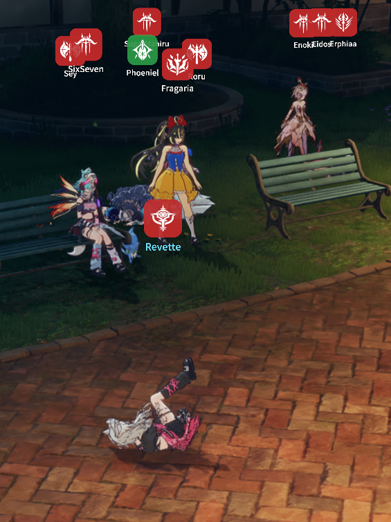

# ミニマルネームプレート

ゲームの頭上ネームプレートを、すっきりとしたロールカラーのクラスバッジと任意のプレイヤー名に置き換えます — ゲーム自身のHUD描画パスに直接描かれるため、くっきりと表示され、ワールドの地形の裏にも正しく隠れます。

## 使い方

1. プラグインをインストールし、**Mod有効** でゲームを起動します。
2. Stellarオーバーレイから **ネームプレート** ウィンドウを開き、**ミニマルネームプレートを有効化（ゲームのネームプレートを無効化）** をオンにします（ゲーム自身のネームプレートが無効になります）。
3. 好みに合わせて調整します。
   - **クラスアイコン（バッジ）を表示** — 各プレイヤーの上に表示されるロールカラーのバッジ。
   - **プレイヤー名（バッジ下）を表示** — バッジの下に表示されるプレイヤー名。
   - **フレンドアイコンを表示** / **ギルドアイコンを表示** — フレンドやギルドメンバーに印を付けます。
   - **バッジサイズ／名前サイズ** — それぞれ独立してスケール調整できます。

## 動作

プレートはゲーム自身のネームプレート表示ルールに従います — グローバルHUDスイッチ（HideUI、カットシーン、フォトモード、メニュー）、タイプ別の頭上情報設定、エンティティごとの非表示設定がすべて適用されるため、ゲーム自体がプレートを表示しない場所では何も表示されません。

自分の頭上をすっきりさせておきたい場合は、自分のキャラクターに対するゲーム自身の頭上情報設定をオフにしてください — プレートはその設定に従います。
