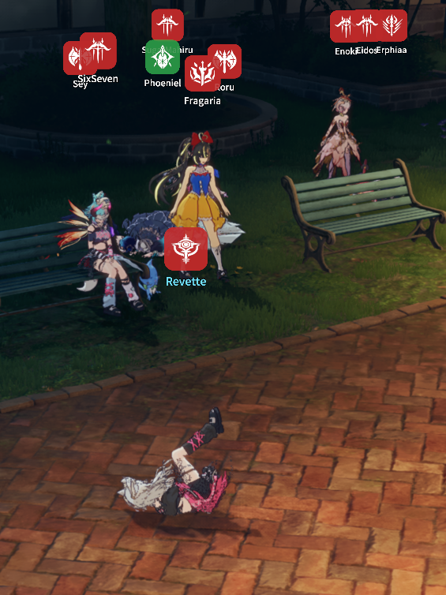

# Minimal Nameplate

Replaces the game's overhead nameplates with a clean, role-coloured class badge and an
optional player name — drawn into the game's own HUD render pass, so it stays crisp and is
correctly hidden behind world geometry.

## How to use

1. Install the plugin and launch the game **Modded**.
2. Open the Minimal Nameplate window from the Stellar overlay and enable it.
3. Tune it to taste:
   - **Show class icon** — the role-coloured badge over each player.
   - **Show name** — the player name under the badge.
   - **Hide self** — keep your own head clear.
   - **Badge size / name size** — scale both independently.

## Behaviour

The plates mirror the game's own nameplate visibility rules — the global HUD switch
(HideUI, cutscenes, photo mode, menus), per-type head-info settings, and per-entity hides
all apply, so nothing shows where the game itself wouldn't show a plate.
