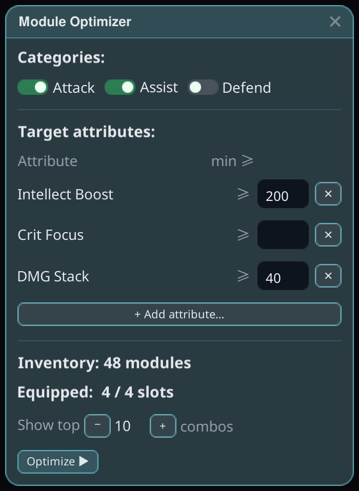
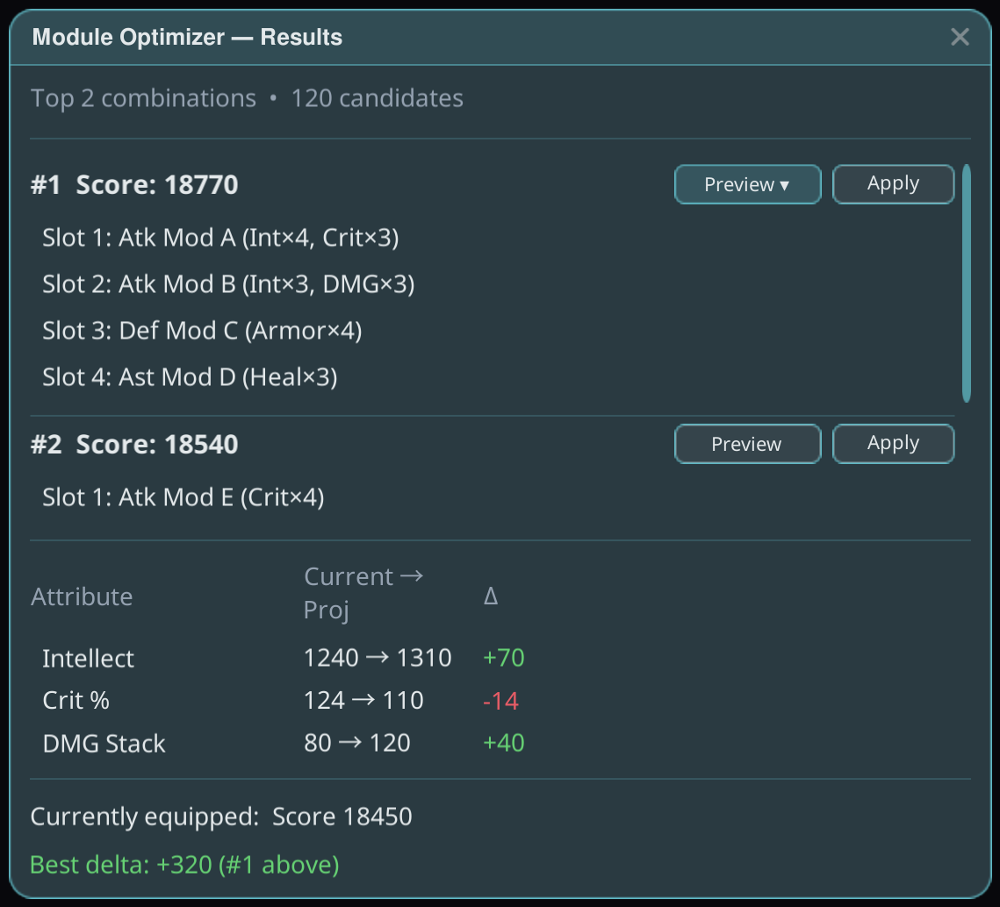

# ตัวปรับโมดูล

หาชุดค่าผสมของโมดูลที่ดีที่สุดสำหรับเป้าหมายที่คุณตั้งไว้ — และสามารถนำไปใช้ให้คุณได้ ผ่านขั้นตอนการสวมใส่ของเกมเอง

## วิธีใช้งาน

1. ติดตั้งปลั๊กอินแล้วเปิดเกมแบบ **ใช้ม็อด**
2. เปิดตัวปรับให้เหมาะสมจากโอเวอร์เลย์ของ Stellar แล้วตั้ง **แอตทริบิวต์เป้าหมาย** — แอตทริบิวต์ที่คุณต้องการและค่าต่ำสุด (เช่น *Life Wave ≥ 20*)
3. รันตัวปรับให้เหมาะสม: มันจะแจกแจงและให้คะแนนชุดค่าผสมโมดูลจากกระเป๋าของคุณ (5 ช่องโมดูลตามแพตช์เกม 3.7) แล้วแสดงตัวเลือกที่ดีที่สุด

4. ตรวจสอบชุดที่แนะนำแล้ว **ใช้งาน** คุณเป็นผู้อนุมัติแผน — ปลั๊กอินจะสวมใส่ผ่านขั้นตอนการสวมใส่ของเกมเอง โดยไม่ข้ามการตรวจสอบของเกมเลย

## เคล็ดลับ

- การใช้งานจะถูกตรวจสอบ: หลังจากแผนทำงานแล้ว ชุดที่สวมใส่จะถูกตรวจสอบซ้ำ และการสวมใส่ใดที่เซิร์ฟเวอร์เพิกเฉยจะถูกส่งซ้ำอีกครั้งหนึ่ง; หากยังล้มเหลวต่อเนื่อง จะระบุชื่อช่องที่ติดขัด
- ค่าต่ำสุดของแอตทริบิวต์รับรู้ขีดจำกัดล่าง — แอตทริบิวต์ที่หายากจะไม่ถูกเป้าหมายร่วมที่มีมากเบียดออกจากกลุ่มตัวเลือก
