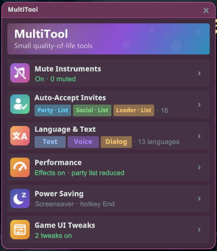
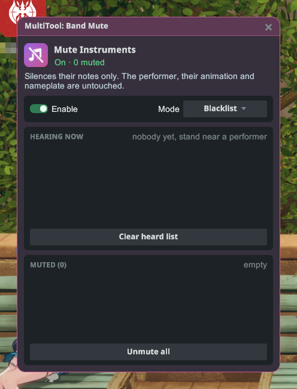
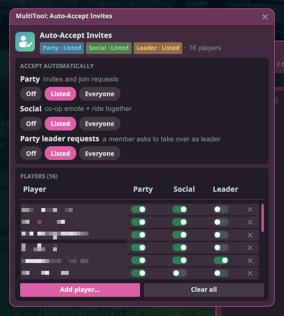
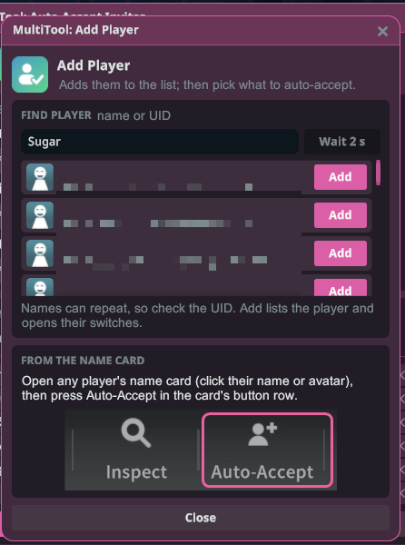
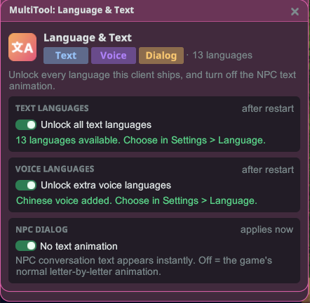
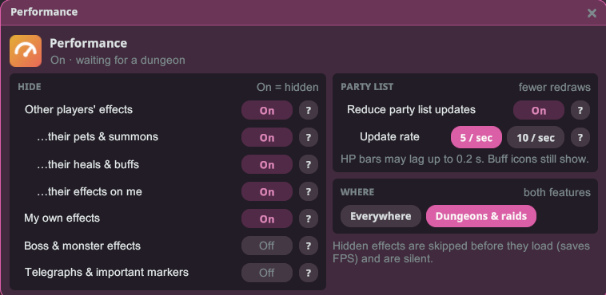
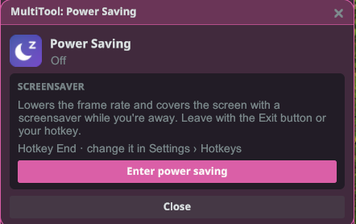

# MultiTool

เครื่องมือเล็ก ๆ ที่ช่วยให้เล่นสะดวกขึ้น รวมไว้ในหน้าต่างเดียว: ปิดเสียงเครื่องดนตรีของผู้เล่นคนอื่น ตอบรับคำเชิญอัตโนมัติจากคนที่คุณเลือก
ปลดล็อกทุกภาษาที่มีอยู่ในไคลเอนต์เกมนี้ แสดงบทสนทนา NPC ทันที ต่อสู้ลื่นขึ้น และสกรีนเซฟเวอร์สำหรับตอนที่คุณไม่อยู่หน้าจอ

## เริ่มต้นใช้งาน

1. ติดตั้งปลั๊กอินแล้วเปิดเกมแบบ **ใช้ม็อด**
2. ล็อกอินเข้าตัวละคร เปิดเมนู Stellar แล้วคลิก **MultiTool**
3. คลิกการ์ดเครื่องมือเพื่อเปิด การ์ดแต่ละใบจะแสดงว่าเครื่องมือนั้นกำลังทำอะไรอยู่ตอนนี้

## Mute Instruments (ปิดเสียงเครื่องดนตรี)

ปิดเสียงเครื่องดนตรีของผู้เล่นคนอื่นที่กำลังเล่นดนตรีอยู่ใกล้ ๆ เงียบเฉพาะเสียงโน้ตเท่านั้น ตัวผู้เล่น ท่าทาง และป้ายชื่อของเขายังแสดงเหมือนเดิมทุกอย่าง

- **Enable** (เปิดใช้) ใช้เปิดหรือปิดการปิดเสียง
- **Mode** (โหมด) ใช้เลือกว่ารายชื่อจะทำงานแบบไหน:
  - **Blacklist** (บัญชีดำ): ปิดเสียงผู้เล่นในรายชื่อของคุณ คนอื่นเล่นได้ตามปกติ
  - **Whitelist** (บัญชีขาว): ปิดเสียงทุกคน ยกเว้นผู้เล่นในรายชื่อของคุณ
- **Hearing now** (กำลังได้ยิน) แสดงทุกคนที่คุณได้ยินกำลังเล่นอยู่ตอนนี้ คลิกชื่อเพื่อเพิ่มลงในรายชื่อของคุณ
- **Muted** (ปิดเสียงแล้ว) / **Allowed** (อนุญาต) คือรายชื่อที่บันทึกไว้ คลิกชื่อเพื่อเอาออกอีกครั้ง
  **Unmute all** (เปิดเสียงทั้งหมด) หรือ **Clear allow-list** (ล้างรายชื่อที่อนุญาต) จะล้างรายชื่อทั้งหมด

รายชื่อของคุณจะถูกเก็บไว้แม้ปิดเกมไปแล้ว ผู้เล่นที่คุณปิดเสียงไว้จะยังถูกปิดเสียงในครั้งต่อไปที่เขาเล่นดนตรีใกล้คุณ

## Auto-Accept Invites (ตอบรับคำเชิญอัตโนมัติ)

ตอบรับคำเชิญและคำขอโดยอัตโนมัติ แต่ละประเภทเลือกได้ 3 แบบ: **Off** (ตอบเอง), **Listed** (เฉพาะผู้เล่นในรายชื่อ) และ **Everyone** (ทุกคน)

- **Party** (ปาร์ตี้): คำเชิญเข้าปาร์ตี้ และคำขอเข้าร่วมปาร์ตี้ของคุณ
- **Social** (โซเชียล): คำชวนทำท่าทางคู่และคำชวนขี่พาหนะด้วยกัน
- **Party leader requests** (คำขอเป็นหัวหน้าปาร์ตี้): สมาชิกขอรับตำแหน่งหัวหน้าต่อ ขณะที่คุณเป็นหัวหน้าปาร์ตี้
- ผู้เล่นแต่ละคนในรายชื่อมีสวิตช์ **Party**, **Social** และ **Leader** เป็นของตัวเอง ใช้เมื่อประเภทนั้นตั้งเป็น **Listed** เอาผู้เล่นออกด้วย **✕** ในแถวของเขา หรือล้างรายชื่อทั้งหมดด้วย **Clear all** (ล้างทั้งหมด)
- เมื่อตอบรับแล้ว การ์ดคำเชิญของเกมจะปิดเอง

### การเพิ่มผู้เล่น

- **From the name card** (จากนามบัตร): เปิดนามบัตรของผู้เล่นคนไหนก็ได้ (คลิกชื่อหรือรูปโปรไฟล์ของเขา) แล้วกด
  **Auto-Accept** ในแถวปุ่มของนามบัตร เขาจะถูกเพิ่มลงในรายชื่อของคุณ และจะมีหน้าต่างเล็ก ๆ เปิดขึ้นให้คุณเลือกว่าจะตอบรับอะไรจากเขาบ้าง สวิตช์ทุกตัวเริ่มต้นที่ปิด
- **ด้วยชื่อหรือ UID**: คลิก **Add player…** (เพิ่มผู้เล่น) พิมพ์ชื่อบางส่วนหรือ UID แล้วกด **Search** (ค้นหา) ชื่ออาจซ้ำกันได้ ให้ดู UID ก่อนกด **Add** (เพิ่ม) เกมจำกัดความถี่ในการค้นหา จึงต้องรอสักครู่ระหว่างการค้นหาแต่ละครั้ง

## Language & Text (ภาษาและข้อความ)

แสดงทุกภาษาข้อความและภาษาเสียงที่มีอยู่ในไคลเอนต์เกมนี้ใน **ตั้งค่า › ภาษา** ของเกม
ไม่ใช่แค่ภาษาที่เปิดให้ใช้ในภูมิภาคของคุณ และให้ข้อความบทสนทนา NPC ขึ้นมาทันที

- **Unlock all text languages** (ปลดล็อกภาษาข้อความทั้งหมด) เพิ่มทุกภาษาข้อความลงในรายการภาษาของเกม
- **Unlock extra voice languages** (ปลดล็อกภาษาเสียงเพิ่มเติม) เพิ่มภาษาเสียงที่มีอยู่ในไคลเอนต์ของคุณ
- การเปลี่ยนภาษาจะมีผลหลังจากรีสตาร์ทเกม จากนั้นเลือกภาษาในการตั้งค่าของเกมเอง
- **No text animation** (ไม่มีแอนิเมชันข้อความ ในส่วน **NPC dialog**): บทสนทนา NPC จะขึ้นมาครบทั้งประโยคทันที
  แทนที่จะค่อย ๆ ขึ้นทีละตัวอักษร มีผลตั้งแต่ประโยคถัดไป ไม่ต้องรีสตาร์ท ค่าเริ่มต้นคือปิด

## Performance (ประสิทธิภาพ)

ต่อสู้ได้ลื่นขึ้นในดันเจี้ยนและเรดที่มีคนเยอะ ซ่อนเอฟเฟกต์สกิลของผู้เล่นคนอื่น และให้รายชื่อปาร์ตี้วาดใหม่น้อยลง

**Hide (ซ่อน)** (สวิตช์ที่เปิดเป็น On จะซ่อนเอฟเฟกต์ประเภทนั้น):

- **Other players' effects (เอฟเฟกต์ของผู้เล่นอื่น)**: ซ่อนเอฟเฟกต์สกิลที่ผู้เล่นคนอื่นใช้ โดยดูจากว่าใครเป็นคนใช้สกิล ดังนั้นการโจมตีของบอสที่โดนผู้เล่นคนอื่นจะยังแสดงอยู่ ปรับละเอียดได้ด้วยสามแถวด้านล่าง:
  - **…their pets & summons (สัตว์เลี้ยงและสิ่งที่อัญเชิญ)**: ซ่อนสัตว์เลี้ยง สิ่งที่อัญเชิญ และกระสุนที่พวกมันยิงด้วย
  - **…their heals & buffs (ฮีลและบัฟ)**: ซ่อนวงฮีลและพื้นที่สนับสนุนด้วย ปล่อยไว้เป็น Off เพื่อให้ยังเห็นว่าควรยืนตรงไหน
  - **…their effects on me (เอฟเฟกต์ที่ใส่ให้ฉัน)**: ซ่อนฮีล โล่ และเอฟเฟกต์อื่นที่ผู้เล่นคนอื่นใส่ให้คุณด้วย
- **My own effects (เอฟเฟกต์ของฉัน)**: ซ่อนภาพสกิลของคุณเอง
- **Boss & monster effects (เอฟเฟกต์บอสและมอนสเตอร์)**: ซ่อนภาพสกิลของบอสและมอนสเตอร์เอง
- **Telegraphs & important markers (สัญญาณเตือนและเครื่องหมายสำคัญ)**: สัญญาณเตือนการโจมตีของบอส พื้นที่อันตราย และวงเล็ง
  ⚠️ ถ้าเปิดเป็น On จะซ่อนสัญญาณเตือนของบอส ซึ่งอาจทำให้เล่นเรดไม่ได้ ปล่อยไว้เป็น Off

เครื่องหมายบนพื้นในเรดและดันเจี้ยนจะแสดงเสมอ เอฟเฟกต์ที่ถูกซ่อนจะไม่มีเสียงด้วย

**Party list (รายชื่อปาร์ตี้)**: **Reduce party list updates (ลดการอัปเดตรายชื่อปาร์ตี้)** จะวาดแถบ HP และไอคอนบัฟในรายชื่อปาร์ตี้ใหม่ไม่เกิน **10** หรือ **5** ครั้งต่อวินาที ช่วยได้มากที่สุดในเรด แถบ HP อาจช้าได้สูงสุด 0.1 วินาที (หรือ 0.2 วินาทีที่ 5 / sec) และไอคอนบัฟยังแสดงอยู่

**Where (ใช้ที่ไหน)** เลือกว่าจะให้ทั้งสองฟีเจอร์ทำงาน **Everywhere (ทุกที่)** หรือเฉพาะ **Dungeons & raids (ดันเจี้ยนและเรด ค่าเริ่มต้น)** ทุกอย่างเริ่มต้นเป็น Off ให้เปิดเฉพาะที่ต้องการ

## Power Saving (ประหยัดพลังงาน)

เปิดสกรีนเซฟเวอร์ของเกมตอนที่คุณไม่อยู่หน้าจอ ช่วยลดเฟรมเรตและคลุมหน้าจอไว้

- **Enter power saving** (เข้าโหมดประหยัดพลังงาน) เริ่มทันที
- ปุ่มลัดของคุณใช้เปิดและปิด: ค่าเริ่มต้นคือ **End** เปลี่ยนได้ที่ **Settings › Hotkeys**
- ออกได้ด้วยปุ่ม **Exit** บนสกรีนเซฟเวอร์หรือปุ่มลัดของคุณ และจะออกเองเมื่อคุณล็อกเอาต์

## หมายเหตุ

- MultiTool เปิดได้เฉพาะตอนที่คุณอยู่ในโลกของเกม และหน้าต่างของมันจะปิดเมื่อคุณล็อกเอาต์
- การปิดเสียงมีผลเฉพาะกับเสียงที่คุณได้ยินเท่านั้น ผู้เล่นคนอื่นยังได้ยินกันตามปกติ
