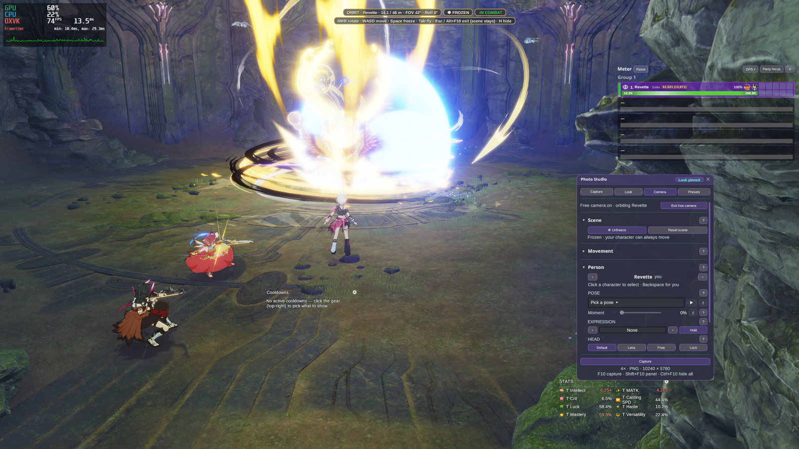

# Photo Studio

Take beautiful screenshots: hide the interface, move a free camera anywhere around the scene, freeze the moment, pose
anyone, shoot in portrait or square, add looks and lights — then save a high-resolution photo.

## Quick start

1. Install the plugin and launch the game **Modded**.
2. Press **Shift+F10** to open the Photo Studio panel.
3. Press **F10** to take a photo. Photos are saved to your screenshots folder (Capture tab → Folder).
4. **Ctrl+F10** hides everything for a clean shot.

All hotkeys can be changed in **Stellar Settings → Hotkeys**.

## The tabs

- **Capture** — resolution (1×, 2× or 4× your screen), the photo's **shape** (Screen, portrait 9:16, 4:5, 2:3,
  square 1:1, wide 21:9), PNG or JPG, the folder, and what to hide while shooting.
- **Look** — colour, exposure, contrast, white balance, depth of field and more. Save your favourite looks as presets.
- **Camera** — the free camera, the scene (freeze / reset), movement settings, and posing people.
- **Lights** — lamps, and a key light and rim for one person.
- **Presets** — load, save, rename and share your looks.

## Hiding yourself and effects

In the **Capture** tab's **Hide** group:

- **Me** hides your character, your pet and your Battle Imagine — on your screen only. You can still move and fight, and
  other players still see you.
- **Effects** hides skill, buff and hit effects by who caused them: **Mine** (yours, your pet's and your Battle Imagine's),
  **Party**, **Other players** and **Monsters** (including boss warning areas). Scenery like waterfalls and lamps is never
  hidden. A few effects the game doesn't link to anyone always stay visible.

These apply while the panel is open and in every photo. In the **Camera** tab, **Hide me on entry** and **Hide effects on
entry** do the same as soon as the free camera turns on (the effects follow your Capture-tab switches). Switching off — or
closing the panel — brings everything back.

## ReShade

Photo Studio can use **ReShade** effects — on your screen and in your photos.

1. In the Stellar launcher, open Photo Studio's page and keep **ReShade** ticked under **Dependencies** (on Linux /
   Proton, also keep the **Microsoft shader compiler** ticked). The launcher downloads and checks them before the game
   starts.
2. Launch the game **Modded**. ReShade is only used in Modded launches; **Vanilla** launches stay ReShade-free.
3. Open the **Look** tab → **ReShade** group: turn **Use ReShade** on, pick a **Preset** (or **None** for no effects) and
   switch effects on or off.
4. Under **Presets**, add ready-made looks with one click, and under **Shader packs** download the effect packs they use.
   Downloaded presets appear in the Preset list right away.

Fine-tune each effect in ReShade's own menu (**Home** by default). Portrait, square and wide photos leave out effects
that need depth; Photo Studio tells you when that happens.

## Free camera

Press **Alt+F10** (or the **Free camera** button) to take control of the camera.

- **Orbit** (default): **right mouse** turns around the person, **mouse wheel** moves closer or further,
  **Q / E** move down / up. **Click** another character to orbit them; **Backspace** returns to you.
- **Fly**: press **Tab**, then **WASD** to move, **right mouse** to look, **Q / E** for down / up.
- **Z / C** tilt the camera, **Shift + wheel** zooms (field of view), **R** returns to the game's view.
- **Space** freezes the scene, **H** hides the key hints, **Esc** or **Alt+F10** leaves the free camera.

## Freezing the scene

**Space** in the free camera (or **Freeze** in the Camera tab) pauses the whole game on your screen — everyone, every
skill and effect, and your own character. Leaving the free camera keeps the world paused; press **Unfreeze** or
**Space** again to resume. The game keeps running on the server: a fight goes on, and anything that happened shows when
you unfreeze. A monster killed while frozen stays on screen until you unfreeze.

## Posing people

In the Camera tab's **Person** group, pick someone with **‹ ›** (or click them in the free camera):

- **Pose** — choose an emote and drag **Moment** to the exact frame; ▶ / ❚❚ play or hold it.
- **Expression** — a facial expression that stays until you change it.
- **Head / Eyes** — look at the camera (Lens), freely (Free) or normally, and lock it.
- **Rotate** — turn them to face where you want.

Other players and NPCs are posed as a copy only you can see; the real person is hidden until you reset the scene.

## Lights

In the **Lights** tab:

- **＋ Lamp at camera** (or **L** in the free camera) places a lamp where the camera is; **Shift+L** moves the selected
  lamp there. Up to 8 lamps, each with any colour, strength and range, placed around the selected person.
- **Light people** sets how strongly lamps colour characters (other people near any lamp are coloured too).
- **Person light** gives one person a **key light** from a chosen side and a coloured **rim** on hair, headwear and
  weapons.

## Ending a scene

**Reset scene** (Camera tab) unfreezes, removes posed copies and lights, and brings everyone back to normal. Changing
zone, a cutscene or turning Photo Studio off does the same.
