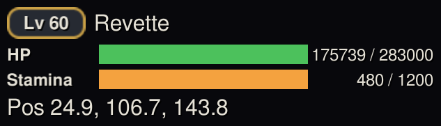

# 플레이어 HUD

HP, 스태미나, 버프 등 자신의 상태를 한눈에 보여주는 간단한 표시 창으로, 화면 어디든 원하는 곳에 둘 수 있습니다.

## 사용 방법

1. 플러그인을 설치하고 게임을 **Modded**로 실행합니다.
2. HUD는 작은 오버레이로 표시됩니다: 레벨 배지, 캐릭터 이름, 정확한 수치가 함께 표시되는 HP·스태미나 바, 현재 위치.
3. 화면 어디로든 드래그할 수 있으며, 위치는 다음 세션에서도 그대로 기억됩니다.

## 팁

- 게임 자체의 파티 프레임을 숨기고 플레이할 때, 또는 바 대신 정확한 HP 수치를 보고 싶을 때 유용합니다.
