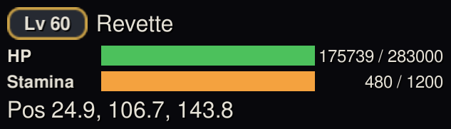

# PlayerHUD

A compact readout of your own vitals — HP, stamina and buffs — that sits wherever you want it.

## How to use

1. Install the plugin and launch the game **Modded**.
2. The HUD appears as a small overlay: level badge, character name, HP and stamina bars with
   exact values, and your current position.
3. Drag it anywhere on screen — the position is remembered across sessions.

## Tips

- Useful when you play with the game's own party frames hidden, or want exact HP numbers
  instead of just a bar.
