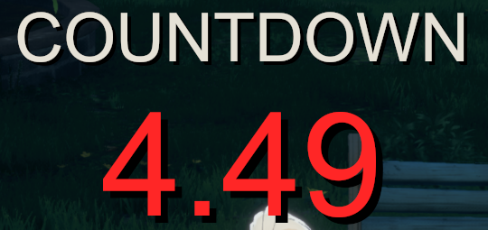
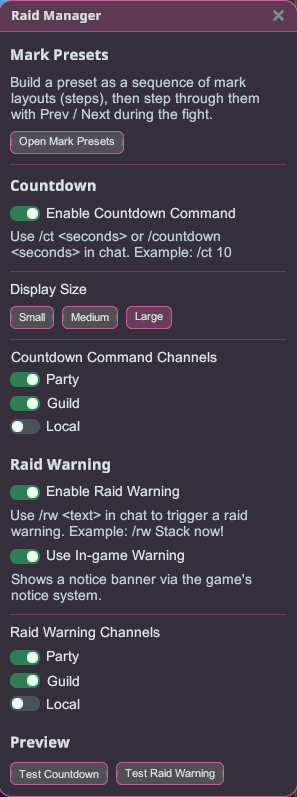

# 레이드 매니저

HUD 오버레이로 표시되는 레이드 조율 도구입니다 — 여러분의 공격대가 이미 쓰고 있는 ZDPS
레이드 콜 관례와 호환됩니다.

## 카운트다운 & 레이드 경고

1. 플러그인을 설치하고 **모드 적용** 상태로 게임을 실행하세요.
2. 채팅에 `/ct <seconds>`를 입력해 화면에 큰 풀 카운트다운을 시작합니다(마지막 5초는 빨간색으로
   바뀝니다).
3. 채팅에 `/rw <message>`를 입력해 이 플러그인을 사용하는 모든 사람에게 레이드 경고 알림을
   띄웁니다.

- **게임 내 경고 사용**(기본 켜짐) — `/rw`를 사용하면 플러그인의 커스텀 오버레이 대신 승리
  효과음과 함께 게임의 기본 알림 배너가 표시되어, 콜이 게임 자체의 알림처럼 보이고 들립니다.

## 표식 프리셋

배치한 던전 마커를 저장하고 전체 배치를 클릭 한 번으로 다시 불러올 수 있습니다 — 여러 단계로
이어진 시퀀스로 말이죠. **레이드 매니저 → 표식 프리셋 열기**에서 엽니다.

**프리셋 만들기**

1. 프리셋을 **생성**하고 이름을 지정한 뒤 **활성화**합니다.
2. 던전에서 첫 번째 단계의 마커를 배치한 다음 **+ 단계 저장**을 누릅니다.
3. 다음 단계의 마커를 배치하고 다시 **+ 단계 저장**을 누릅니다 — 각 단계마다 반복합니다.

**전투 중 사용하기**

- **다음 ▶** / **◀ 이전**으로 단계를 이동하며, 보드를 지우고 해당 단계의 마커를 배치합니다.
- **초기화**를 누르면 비어 있는 **시작** 상태로 돌아갑니다.
- 게임의 키 설정에서 **이전 / 초기화 / 다음**에 원하는 단축키를 지정하세요(기본값은 지정되어
  있지 않습니다).

레이드마다 별도의 프리셋을 유지하고, 지금 진행 중인 레이드의 프리셋을 **활성화**하세요(버튼이
**비활성화**로 바뀝니다). 마커 배치는 던전에서 작동합니다.

**이름 변경 및 메모 추가**

- 프리셋 옆의 **연필** 아이콘을 클릭하면 이름을 바꿀 수 있습니다.
- 현재 단계 아래의 **연필** 아이콘을 클릭하면 메모를 추가할 수 있습니다 — 예: "2페이즈 — 서쪽
  집결". 이 메모는 해당 단계로 이동할 때 뜨는 팝업에도 표시됩니다.

**프리셋 공유하기**

1. 프리셋을 활성화하고 **프리셋 내보내기**를 클릭한 다음 **복사**를 누르거나, 코드를 선택하고
   Ctrl+C를 누릅니다.
2. 코드를 그룹원에게 전달합니다.
3. 그룹원은 **프리셋 가져오기**를 클릭해 코드를 붙여넣고 **가져오기**를 누릅니다. 그러면 모든
   단계, 마커, 메모를 포함한 프리셋 전체를 그대로 받게 됩니다.

## 참고

- 게임 메뉴(ESC)가 열려 있어도 두 오버레이 모두 계속 표시됩니다.
