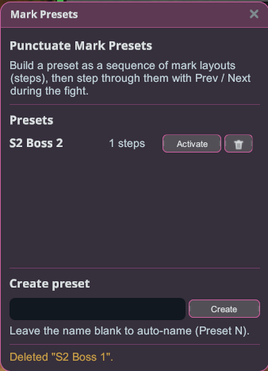
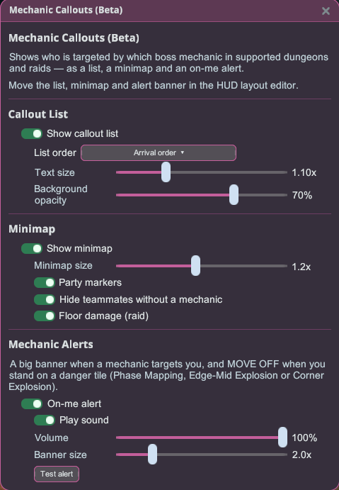
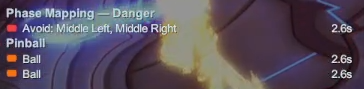
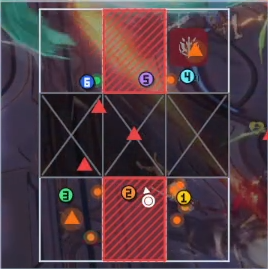
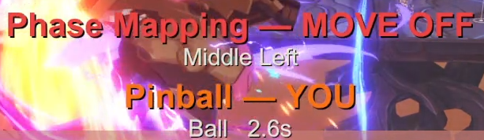

# ตัวจัดการเรด

เครื่องมือประสานงานเรดที่แสดงเป็นโอเวอร์เลย์ HUD — ใช้งานร่วมกับธรรมเนียมการร้องเรด (raid-call) แบบ ZDPS ที่ปาร์ตี้ประจำของคุณใช้อยู่แล้วได้

## นับถอยหลัง & การแจ้งเตือนเรด

1. ติดตั้งปลั๊กอินแล้วเปิดเกมแบบ**ใช้ม็อด**
2. พิมพ์ `/ct <seconds>` ในแชทเพื่อเริ่มการนับถอยหลังก่อนบุกขนาดใหญ่บนหน้าจอ (จะเปลี่ยนเป็นสีแดงใน 5 วินาทีสุดท้าย)
3. พิมพ์ `/rw <message>` เพื่อส่งข้อความแจ้งเตือนเรดแบบแฟลชไปยังทุกคนที่ใช้ปลั๊กอินนี้

- **ใช้การแจ้งเตือนในเกม** (เปิดโดยค่าเริ่มต้น) — `/rw` จะแสดงแบนเนอร์แจ้งเตือนของเกมเองพร้อมเสียงชัยชนะ แทนที่โอเวอร์เลย์ของปลั๊กอิน ทำให้การแจ้งเตือนดูและฟังดูเหมือนเป็นการแจ้งเตือนของเกมเอง

## พรีเซ็ตมาร์ก

บันทึกมาร์กเกอร์ดันเจี้ยนที่คุณวางไว้ แล้วโหลดเลย์เอาต์ทั้งหมดกลับมาได้ในคลิกเดียว — เป็นลำดับเฟสหลายขั้นตอน เปิดได้จาก**ตัวจัดการเรด → เปิดพรีเซ็ตมาร์ก**

**สร้างพรีเซ็ต**

1. **สร้าง**พรีเซ็ต ตั้งชื่อ แล้ว**ใช้งาน**
2. ในดันเจี้ยน วางมาร์กเกอร์สำหรับเฟสแรก แล้วกด**+ บันทึกสเต็ป**
3. วางมาร์กเกอร์ของเฟสถัดไป แล้วกด**+ บันทึกสเต็ป**อีกครั้ง — ทำซ้ำสำหรับทุกเฟส

**ใช้งานระหว่างการต่อสู้**

- **ถัดไป ▶** / **◀ ก่อนหน้า**เลื่อนไปตามสเต็ป ล้างกระดานแล้ววางมาร์กเกอร์ของเฟสนั้น
- **รีเซ็ต**จะกลับไปที่**เริ่มต้น**ที่ว่างเปล่า
- ผูก**พรีเซ็ตมาร์ก: สเต็ปก่อนหน้า**, **พรีเซ็ตมาร์ก: รีเซ็ตสู่จุดเริ่มต้น**, **พรีเซ็ตมาร์ก: สเต็ปถัดไป**กับปุ่มของคุณเองได้ที่**การตั้งค่า Stellar → ปุ่มลัด** (ค่าเริ่มต้นยังไม่ได้กำหนด)

เก็บพรีเซ็ตแยกไว้สำหรับแต่ละเรด และ**ใช้งาน**พรีเซ็ตของเรดที่คุณกำลังเล่นอยู่ (ปุ่มจะเปลี่ยนเป็น**ปิดใช้งาน**) การวางมาร์กเกอร์ใช้ได้ในดันเจี้ยน

**เปลี่ยนชื่อและเพิ่มบันทึก**

- คลิก**ดินสอ**ข้างพรีเซ็ตเพื่อเปลี่ยนชื่อ
- คลิก**ดินสอ**ใต้สเต็ปปัจจุบันเพื่อเพิ่มบันทึก — เช่น "P2 — รวมพลฝั่งตะวันตก" บันทึกนี้จะแสดงในป๊อปอัปด้วยเมื่อคุณเลื่อนไปยังสเต็ปนั้น

**แชร์พรีเซ็ต**

1. ใช้งานพรีเซ็ตแล้วคลิก**ส่งออกพรีเซ็ต** จากนั้นกด**คัดลอก** — หรือเลือกโค้ดแล้วกด Ctrl+C
2. ส่งโค้ดให้กลุ่มของคุณ
3. พวกเขาคลิก**นำเข้าพรีเซ็ต** วางโค้ด แล้วกด**นำเข้า** พวกเขาจะได้พรีเซ็ตทั้งหมด — ทุกสเต็ป มาร์กเกอร์ และบันทึก

## แจ้งเตือนกลไก (เบต้า)

ดูได้ในพริบตาว่ากลไกของบอสแต่ละอันเล็งใครอยู่ — ทั้งในรูปแบบรายการ มินิแมป และการแจ้งเตือนขนาดใหญ่เมื่อเป็นคุณ เปิดได้จาก**ตัวจัดการเรด → เปิดแจ้งเตือนกลไก (เบต้า)**

**คอนเทนต์ที่รองรับ**

- เรด Forgotten Dreamwild — Clash!, Brutal! และ Purge!
- Cursed Radiant Tomb
- Sea-Ringed Reef
- Towering Ruin
- Tina's Mindrealm

นอกเหนือจากนี้ รายการแจ้งเตือนจะว่างเปล่า

**รายการแจ้งเตือน** — แสดงกลไกแต่ละอันพร้อมเวลานับถอยหลังและผู้เล่นที่ถูกเล็ง เลือกลำดับได้ (**ตามลำดับที่เกิดขึ้น**, **ด่วนที่สุดก่อน** หรือ **ตามลำดับตาราง**) รวมถึงขนาดตัวอักษรและความทึบของพื้นหลัง

**มินิแมป** — แสดงปาร์ตี้ของคุณบนสนามต่อสู้ แยกสีตามกลไก พร้อมมาร์กของปาร์ตี้และพื้นที่อันตราย ในเรดยังแสดงความเสียหายจากพื้น ลำดับการกดคริสตัล และขั้นของวงแม่เหล็กไฟฟ้าที่มีหมายเลขกำกับ

**การแจ้งเตือนกลไก** — แสดงแบนเนอร์ขนาดใหญ่เมื่อกลไกเล็งมาที่คุณ และแจ้ง**ออกจากช่อง**เมื่อคุณยืนบนช่องอันตราย ในช่วงวงแหวนของเรดจะบอกว่าคุณต้องย้ายไปวงไหน เปิดเสียงได้ตามต้องการพร้อมปรับระดับเสียงแยก ใช้**ทดสอบการแจ้งเตือน**เพื่อดูตัวอย่าง (ปิดอยู่เป็นค่าเริ่มต้น)

ย้ายรายการ มินิแมป และแบนเนอร์ไปไว้ตรงไหนก็ได้ในตัวแก้ไขเลย์เอาต์ HUD

## หมายเหตุ

- โอเวอร์เลย์ทั้งสองยังคงแสดงอยู่แม้เมนูเกม (ESC) จะเปิดอยู่
