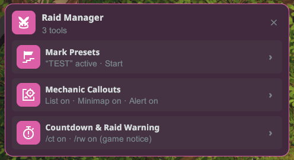
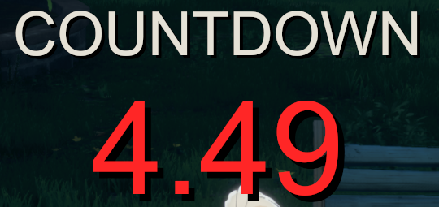
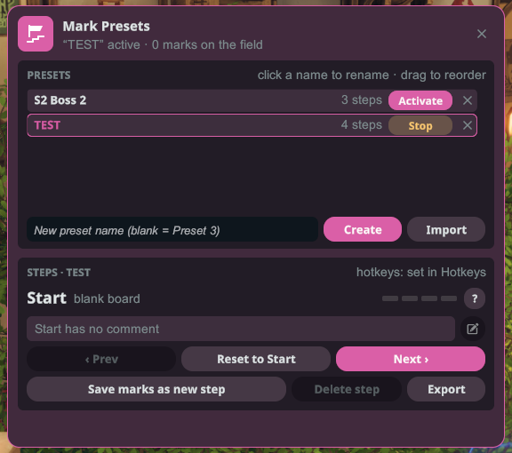
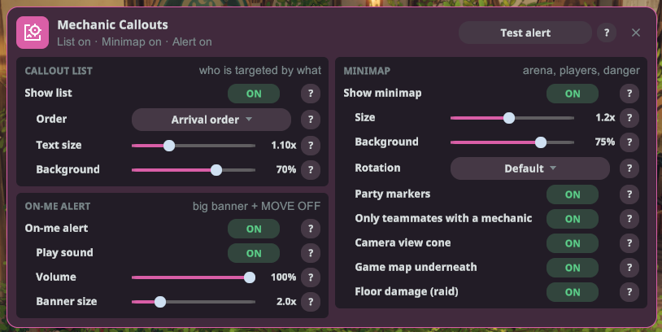
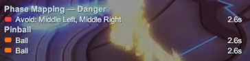
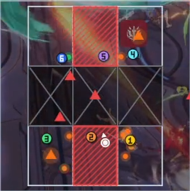
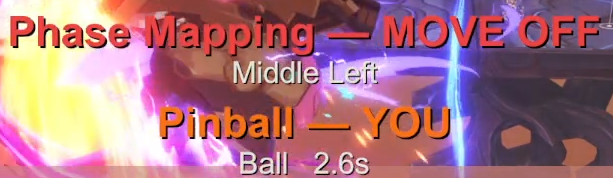

# ตัวจัดการเรด

เครื่องมือประสานงานเรดที่แสดงเป็นโอเวอร์เลย์ HUD — ใช้งานร่วมกับธรรมเนียมการร้องเรด (raid-call) แบบ ZDPS ที่ปาร์ตี้ประจำของคุณใช้อยู่แล้วได้

เปิด**ตัวจัดการเรด**จากลันเชอร์ ในหน้าต่างมีการ์ดสามใบ แต่ละใบแสดงสถานะปัจจุบันให้เห็นได้ทันที:
**พรีเซ็ตมาร์ก**, **แจ้งเตือนกลไก** และ **นับถอยหลังและแจ้งเตือนเรด**

ทุกการตั้งค่ามีปุ่ม **?** อยู่ข้าง ๆ ที่อธิบายว่าการตั้งค่านั้นทำอะไร

## นับถอยหลังและแจ้งเตือนเรด

1. ติดตั้งปลั๊กอินแล้วเปิดเกมแบบ**ใช้ม็อด**
2. พิมพ์ `/ct <seconds>` ในแชทเพื่อเริ่มการนับถอยหลังก่อนบุกขนาดใหญ่บนหน้าจอ (จะเปลี่ยนเป็นสีแดงใน 5 วินาทีสุดท้าย)
   พิมพ์ `/ct stop` เพื่อยกเลิก
3. พิมพ์ `/rw <message>` เพื่อส่งข้อความแจ้งเตือนเรดแบบแฟลชไปยังทุกคนที่ใช้ปลั๊กอินนี้

เปิด**นับถอยหลังและแจ้งเตือนเรด**เพื่อตั้งค่า:

- เปิดหรือปิด**คำสั่งนับถอยหลัง**และ**แจ้งเตือนเรด** แล้วเลือกช่องแชทที่จะฟัง (**ปาร์ตี้**, **กิลด์**, **ท้องถิ่น**)
- เลือก**ขนาด**ของการนับถอยหลัง
- **รูปแบบ** — **ประกาศของเกม** (ค่าเริ่มต้น) จะแสดง `/rw` เป็นแบนเนอร์ประกาศของเกมเองพร้อมเสียง; **ข้อความสีแดง** จะใช้ตัวอักษรสีแดงขนาดใหญ่ของปลั๊กอิน โดยมี**ขนาดข้อความ**แยกต่างหาก
- **ทดสอบนับถอยหลัง** และ **ทดสอบแจ้งเตือนเรด** ใช้ดูตัวอย่างทั้งสองแบบโดยไม่ส่งอะไรลงแชท

ย้ายการนับถอยหลังไปไว้ตรงไหนก็ได้ในตัวแก้ไขเลย์เอาต์ HUD — จะมีตัวอย่างแสดงอยู่ระหว่างที่คุณแก้ไข

## พรีเซ็ตมาร์ก

บันทึกมาร์กเกอร์ดันเจี้ยนที่คุณวางไว้ แล้วโหลดเลย์เอาต์ทั้งหมดกลับมาได้ในคลิกเดียว — เป็นลำดับเฟสหลายขั้นตอน เปิดได้จากการ์ด**พรีเซ็ตมาร์ก**

**สร้างพรีเซ็ต**

1. พิมพ์ชื่อแล้วกด**สร้าง** (เว้นว่างไว้เพื่อให้ตั้งชื่ออัตโนมัติ) จากนั้นกด**ใช้งาน**
2. ในดันเจี้ยน วางมาร์กเกอร์สำหรับเฟสแรก แล้วกด**บันทึกมาร์กเป็นสเต็ปใหม่**
3. วางมาร์กเกอร์ของเฟสถัดไป แล้วกด**บันทึกมาร์กเป็นสเต็ปใหม่**อีกครั้ง — ทำซ้ำสำหรับทุกเฟส

**ใช้งานระหว่างการต่อสู้**

- **ถัดไป ›** / **‹ ก่อนหน้า**เลื่อนไปตามสเต็ป ล้างกระดานแล้ววางมาร์กเกอร์ของเฟสนั้น
- **กลับไปเริ่มต้น**จะกลับไปที่**เริ่มต้น**ที่ว่างเปล่า
- ผูก**พรีเซ็ตมาร์ก: สเต็ปก่อนหน้า**, **พรีเซ็ตมาร์ก: รีเซ็ตสู่จุดเริ่มต้น**, **พรีเซ็ตมาร์ก: สเต็ปถัดไป**กับปุ่มของคุณเองได้ที่**การตั้งค่า Stellar → ปุ่มลัด** (ค่าเริ่มต้นยังไม่ได้กำหนด)

เก็บพรีเซ็ตแยกไว้สำหรับแต่ละเรด และ**ใช้งาน**พรีเซ็ตของเรดที่คุณกำลังเล่นอยู่ (กด**หยุด**เพื่อปิด) การวางมาร์กเกอร์ใช้ได้ในดันเจี้ยน

**จัดระเบียบพรีเซ็ต**

- คลิกชื่อพรีเซ็ตเพื่อเปลี่ยนชื่อ แล้วกด Enter
- ลากพรีเซ็ตขึ้นหรือลงเพื่อจัดลำดับรายการใหม่
- ปุ่ม **✕** ในแถวจะลบพรีเซ็ตหลังจากที่คุณยืนยัน
- คลิก**ดินสอ**ข้างสเต็ปปัจจุบันเพื่อเพิ่มบันทึก — เช่น "P2 — รวมพลฝั่งตะวันตก" บันทึกนี้จะแสดงในป๊อปอัปด้วยเมื่อคุณเลื่อนไปยังสเต็ปนั้น

**แชร์พรีเซ็ต**

1. ใช้งานพรีเซ็ตแล้วกด**ส่งออก** จากนั้นกด**คัดลอก**
2. ส่งโค้ดให้กลุ่มของคุณ
3. พวกเขากด**นำเข้า** จากนั้นกด**วาง**และ**นำเข้า** พวกเขาจะได้พรีเซ็ตทั้งหมด — ทุกสเต็ป มาร์กเกอร์ และบันทึก

## แจ้งเตือนกลไก

ดูได้ในพริบตาว่ากลไกของบอสแต่ละอันเล็งใครอยู่ — ทั้งในรูปแบบรายการ มินิแมป และการแจ้งเตือนขนาดใหญ่เมื่อเป็นคุณ เปิดได้จากการ์ด**แจ้งเตือนกลไก**

**คอนเทนต์ที่รองรับ**

- เรด Forgotten Dreamwild — Clash!, Brutal! และ Purge!
- Cursed Radiant Tomb
- Sea-Ringed Reef
- Towering Ruin
- Tina's Mindrealm

นอกเหนือจากนี้ รายการแจ้งเตือนจะว่างเปล่า

**รายการแจ้งเตือน** — แสดงกลไกแต่ละอันพร้อมเวลานับถอยหลังและผู้เล่นที่ถูกเล็ง เลือกลำดับได้ (**ตามลำดับที่เกิดขึ้น**, **ด่วนที่สุดก่อน** หรือ **ตามลำดับตาราง**) รวมถึงขนาดตัวอักษรและความทึบของพื้นหลัง

**มินิแมป** — แสดงปาร์ตี้ของคุณบนสนามต่อสู้ แยกสีตามกลไก พร้อมมาร์กของปาร์ตี้และพื้นที่อันตราย ในเรดยังแสดงความเสียหายจากพื้น ลำดับการกดคริสตัล ขั้นของวงแม่เหล็กไฟฟ้าที่มีหมายเลขกำกับ เส้นพุ่งของโกเลม ตำแหน่งที่พัดหมุนจะหยุด และเส้นเลเซอร์ของปืนใหญ่

ในการตั้งค่ามินิแมปยังเลือกเปิดกรวยกล้องที่แสดงทิศที่คุณมอง แผนที่ของเกมเองด้านล่าง ความทึบของพื้นหลัง และการหมุนแผนที่ได้

**แจ้งเตือนเมื่อโดนตัวเอง** — แสดงแบนเนอร์ขนาดใหญ่เมื่อกลไกเล็งมาที่คุณ และแจ้ง**ออกจากช่อง**เมื่อคุณยืนบนช่องอันตราย ในช่วงวงแหวนของเรดจะบอกว่าคุณต้องย้ายไปวงไหน เปิดเสียงได้ตามต้องการพร้อมปรับระดับเสียงแยก ใช้**ทดสอบการแจ้งเตือน**เพื่อดูตัวอย่าง (ปิดอยู่เป็นค่าเริ่มต้น)

ย้ายรายการ มินิแมป และแบนเนอร์ไปไว้ตรงไหนก็ได้ในตัวแก้ไขเลย์เอาต์ HUD

## หมายเหตุ

- โอเวอร์เลย์ทั้งสองยังคงแสดงอยู่แม้เมนูเกม (ESC) จะเปิดอยู่
