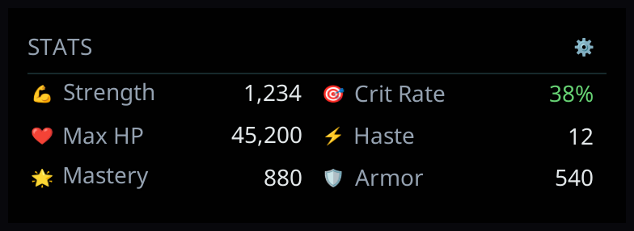
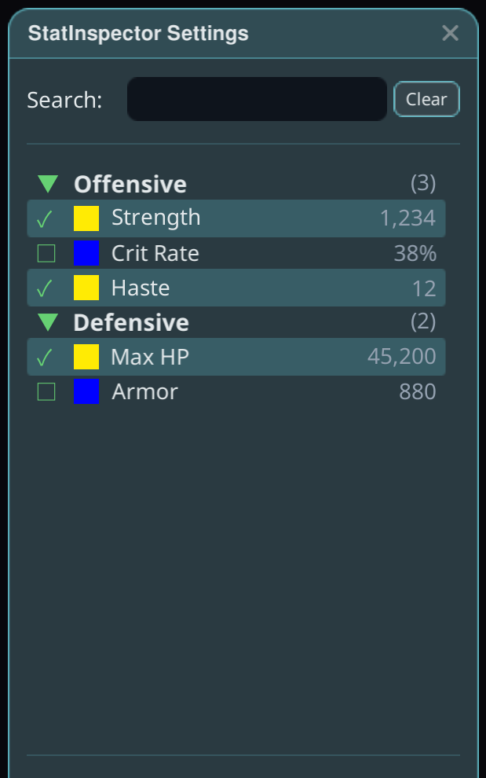

# StatInspector

Ang live na attribute ng character mo sa screen — compact na mini-HUD na may eksaktong mga stat na mahalaga sa iyo.

## Paano gamitin

1. I-install ang plugin at buksan ang laro sa **May mod**.
2. Buksan ang window ng StatInspector mula sa overlay ng Stellar para piliin ang iyong mga stat: nakalista sa grouped settings picker ang bawat attribute — markahan ang mga gusto mong makita sa mini-HUD.

3. I-drag ang mini-HUD kahit saan. Natatandaan ang posisyon at shown/hidden na estado nito kahit mag-relaunch ka.

## Mga Tip

- Live na nag-a-update ang mga value, kaya kapaki-pakinabang ito para tingnan kung paano talaga naaapektuhan ng pagpalit ng gear o module ang mga numero mo.
