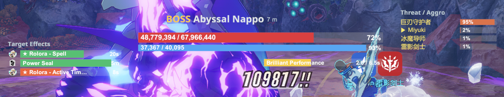
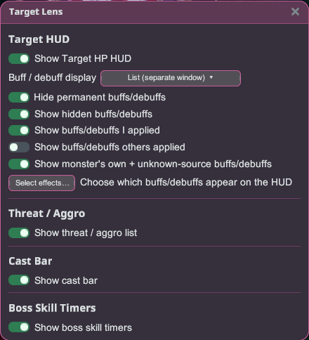

# Target Lens

Kenali targetmu. Target Lens membaca target pertarunganmu saat ini dan menampilkan semua hal
penting — HP, shield, dan gauge break-nya, buff dan debuff pada target, siapa yang memegang
aggro, skill mematikan berikutnya dari bos, dan cast bar-nya — sebagai overlay yang rapi dan
bisa diseret.

## Memulai

1. Instal plugin lalu jalankan game dalam mode **Modded**.
2. Buka overlay launcher dan klik **Target Lens** untuk membuka pengaturannya.
3. Target sesuatu saat bertarung — overlay akan muncul secara otomatis. Seret overlay mana pun
   untuk memindahkannya dan seret tepinya untuk mengubah ukuran; posisinya akan diingat.

## Overlay

- **HUD Target** — **HP** target, **shield**-nya ("armor"), serta **gauge break / stagger** bos,
  plus nama, rank, dan jarak.
- **Efek Target** — buff dan debuff pada target, masing-masing dengan ikon dan sisa waktunya.
  Efekmu sendiri ditandai dengan **★**.
- **Ancaman / Aggro** — siapa yang menjadi fokus bos dan **% ancaman** setiap pemain; barismu
  sendiri akan disorot.
- **Pengatur Waktu Skill Bos** — **hitung mundur** langsung ke skill berbahaya bos, agar kamu bisa
  bereaksi tepat waktu. Muncul selama pertarungan bos yang menggunakan fitur ini.
- **Bilah Cast** — cast/channel target, terisi seiring prosesnya; cast berbahaya ditandai dengan
  warna khusus.

## Tampilan buff / debuff

Di bagian **Tampilan buff / debuff** kamu bisa memilih cara efek ditampilkan:

- **Klasik (di HUD Target)** — tile ringkas di dalam HUD Target.
- **Daftar (jendela terpisah)** — jendela terpisah yang bisa diubah ukurannya, dengan satu baris
  per efek (ikon, nama, dan waktu).
- **Mati (tersembunyi)** — menyembunyikan tampilan efek sepenuhnya.

Filter apa yang ditampilkan berdasarkan **siapa yang memberikannya**:

- **Tampilkan buff/debuff yang saya berikan** — efekmu sendiri (ditandai ★).
- **Tampilkan buff/debuff yang diberikan orang lain** — efek dari pemain lain.
- **Tampilkan buff/debuff milik monster & dari sumber tak dikenal** — buff milik bos sendiri dan
  efek ambien.

Kamu juga bisa **menyembunyikan buff/debuff permanen** (tanpa timer), **menampilkan buff/debuff
tersembunyi** (efek internal), dan membuka **Pilih efek…** untuk memilih persis buff/debuff mana
yang muncul — efek yang direkomendasikan ditandai **★** dan diurutkan ke atas.

## Tips

- **Kunci ke target** — tetapkan tombol untuk hotkey "Kunci HUD ke target saat ini" di pengaturan
  hotkey launcher. Tekan saat bertarung untuk mengunci overlay ke targetmu saat ini, sehingga tetap
  menampilkan musuh itu selagi kamu melawan musuh lain; tekan lagi untuk melepaskannya. Terlepas
  otomatis saat target mati.
- **Ukuran tiap overlay** — daftar efek, daftar ancaman/aggro, cast bar, dan pengatur waktu skill
  bos masing-masing punya slider ukuran sendiri, dan kamu bisa menyembunyikan judul overlay mana
  pun.
- Semuanya opsional — aktifkan atau nonaktifkan overlay mana pun di pengaturan yang sudah
  dikelompokkan (HUD Target / Ancaman / Aggro / Bilah Cast / Pengatur Waktu Skill Bos).
- Gunakan **"Atur ulang semua"** di launcher untuk mengembalikan semua overlay ke posisi
  bawaannya.
- Dilokalkan dalam **Bahasa Inggris, Jepang, Thailand, Indonesia, dan Filipino** — mengikuti bahasa
  launcher.
