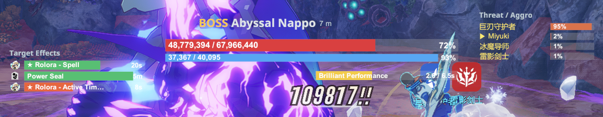
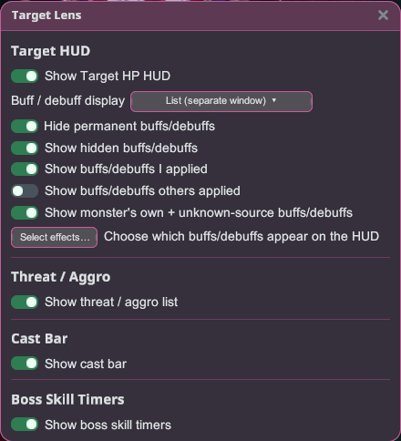

# Target Lens

Know your target. Target Lens reads your current combat target and lays out everything that
matters — its health, shield and break gauge, the buffs and debuffs on it, who's holding aggro,
the boss's next deadly skill, and its cast bar — as clean, draggable overlays.

## Getting started

1. Install the plugin and launch the game **Modded**.
2. Open the launcher overlay and click **Target Lens** to open its settings.
3. Target something in combat — the overlays appear automatically. Drag any overlay to move it and
   drag its edge to resize; positions are remembered.

## The overlays

- **Target HUD** — the target's **HP**, its **shield** ("armor"), and the boss **break / stagger
  gauge**, plus name, rank and distance.
- **Target Effects** — the buffs and debuffs on the target, each with its icon and remaining time.
  Your own effects are marked with a **★**.
- **Threat / Aggro** — who the boss is focused on and each player's **threat %**; your own row is
  highlighted.
- **Boss Skill Timers** — a live **countdown** to the boss's dangerous skills, so you can react in
  time. Appears during boss fights that use them.
- **Cast bar** — the target's channel/cast, filling as it casts; dangerous casts are accented.

## Buff / debuff display

Under **Buff / debuff display** you can choose how effects are shown:

- **Classic** — compact tiles inside the Target HUD.
- **List** — a separate, resizable window with a row per effect (icon, name, and time).
- **Off** — hide the effect display entirely.

Filter what shows by **who applied it**:

- **Show buffs/debuffs I applied** — your own effects (marked ★).
- **Show buffs/debuffs others applied** — effects from other players.
- **Show monster's own + unknown-source buffs/debuffs** — the boss's self-buffs and ambient effects.

You can also **hide permanent** (no-timer) effects, **show hidden** internal effects, and open
**Select effects…** to pick exactly which buffs/debuffs appear — recommended ones are marked with a
**★** and sorted to the top.

## Tips

- Everything is optional — toggle any overlay on or off in the grouped settings (Target HUD /
  Threat / Aggro / Cast Bar / Boss Skill Timers).
- Use the launcher's **"reset all HUD"** to return every overlay to its default position.
- Localized in **English, Japanese, Thai, Indonesian and Filipino** — it follows the launcher
  language.
