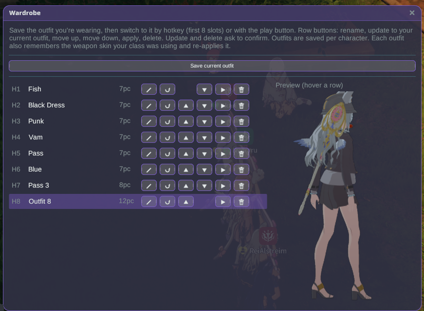

# ワードローブ

着ている衣装を保存し、ホットキーやメニューから即座に切り替えられます — ホバーした衣装の
ライブ3Dプレビュー付きで。

## 使い方

1. プラグインをインストールし、**Modded** でゲームを起動します。
2. ゲーム内で好きなように着飾り、Stellarランチャーから **ワードローブ** を開いて（または
   ウィンドウ切り替えホットキーを割り当てて）**現在の衣装を保存** をクリックします。そのキャラ
   クター用の名前付きスロットに保存されます。
3. ゲーム内で衣装を変更した後、以前のものに戻すには:
   - 割り当てたホットキーを押します — 最初の8つの保存済み衣装は **apply.1**〜**apply.8**
     に対応します（**Stellar 設定 → ホットキー** で割り当て、初期状態では未設定です）。または
   - ワードローブウィンドウの任意の行にある **再生** ボタンをクリックします。

## 行のボタン

保存した衣装ごとに小さなツールバーがあります。

- **✎ 名前変更** — 衣装に名前を付けます。
- **⟳ 更新** — 今着ている衣装を再キャプチャしてこのスロットに入れます（名前と位置は保持）。
- **▲ / ▼ 並べ替え** — 上下に移動します；最初の8スロットがホットキースロットです。
- **▶ 適用** — この衣装を着用します。
- **🗑 削除** — 削除します。

更新と削除は、実行前に確認を求めます。

## プレビュー

任意の行にカーソルを合わせると、自分のキャラクターのライブ3Dモデルでその衣装を確認できます。
**ドラッグ** で回転、**スクロール** でズーム、**Shift+ドラッグ** でパンできます。

## 補足

- 衣装は **キャラクターごと** に保存されます。
- 切り替えはゲーム自身のファッションシステムを通じて行われ、ゲーム自体のルールが適用されます
  （例：戦闘中は衣装を変更できません）— 今は切り替えが許可されていない場合、ゲームがバナーで
  知らせます。
- プラグインは English、日本語、ไทย、Bahasa Indonesia、Filipino で利用できます。
