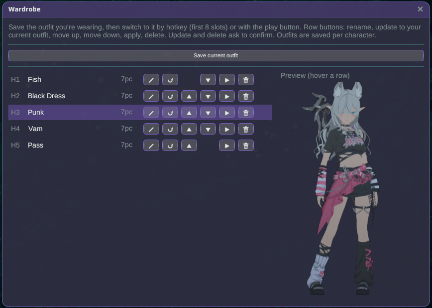

# Wardrobe

Save the outfits you wear and switch between them instantly — by hotkey or from a menu — with a live 3D preview.

## How to use

1. Install the plugin and launch the game **Modded**.
2. Dress up in-game however you like, then open **Wardrobe** from the Stellar launcher (or bind its
   window-toggle hotkey) and click **Save current outfit**. It's stored in a named slot for that character.
3. Change your outfit in-game, then bring an old one back:
   - Press a bound hotkey — the first 8 saved outfits map to **apply.1**–**apply.8** (bind them in
     **Stellar Settings → Hotkeys**, they ship unbound), or
   - Click the **play** button on any row in the Wardrobe window.

## Row buttons

Each saved outfit has a small toolbar:

- **✎ rename** — give the outfit a name.
- **⟳ update** — re-capture the outfit you're wearing right now into this slot (keeps its name and place).
- **▲ / ▼ reorder** — move it up or down; the first 8 slots are the hotkey slots.
- **▶ apply** — wear this outfit.
- **🗑 delete** — remove it.

Update and delete ask you to confirm first.

## Preview

Hover any row to see that outfit on a live 3D model of your character. **Drag** to rotate, **scroll** to
zoom, and **shift-drag** to pan.

## Notes

- Outfits are saved **per character**.
- Switching runs through the game's own fashion system, which applies its own rules (for example, you
  can't change outfit in combat) — the game shows a banner if a switch isn't allowed right now.
- The plugin is available in English, 日本語, ไทย, Bahasa Indonesia and Filipino.
